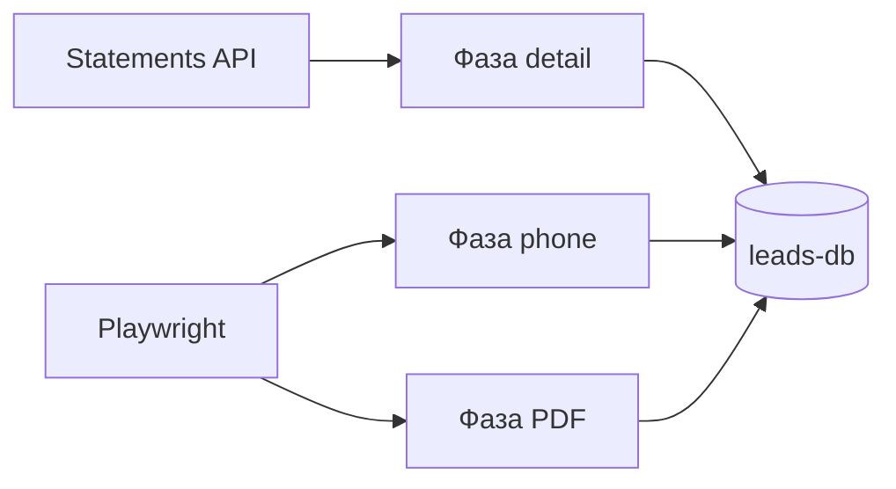

# PropRadar

Автоматизированная система генерации лидов с рынка недвижимости Грузии.

Система парсит объявления от частных продавцов, устанавливает контакт через WhatsApp,
собирает структурированные данные и передаёт готовые лиды агентствам недвижимости.

---

## Пайплайн

```
[1] Парсинг          — мониторинг объявлений (myhome.ge, SS.ge)
        ↓
[2] Фильтрация       — скоринг, отсев агентств, дедупликация
        ↓
[3] Коммуникация     — WhatsApp-бот: согласие → сбор данных
        ↓
[4] Монетизация      — передача агентствам, трекинг сделок
```

---

## Стек


| Слой        | Технология                                                     |
| ----------- | -------------------------------------------------------------- |
| Парсинг     | Python + Playwright                                            |
| База данных | PostgreSQL (`leads-db`, порт 5433)                             |
| WhatsApp    | Evolution API (Docker, self-hosted)                            |
| Оркестрация | n8n (self-hosted)                                              |
| Дашборд     | Metabase (Docker, порт **3031** локально — см. `docker/tools`) |


---

## Структура репозитория

```
PropRadar/
├── .cursor/                  # AI-агенты и правила
├── docs/                     # Канонические документы
├── src/                      # Python-пакеты: api, config, domain, parsers, repositories, services
├── tests/                    # unit / integration / e2e (каркас)
├── migrations/               # SQL-миграции (leads-db)
├── scripts/                  # setup_venv.ps1 и др.
├── docker/
│   ├── infra/                # PostgreSQL 15 (leads-db, хост-порт 5433)
│   ├── tools/                # n8n, Metabase:3031, Evolution API:8080
│   └── app/                  # Каркас parsers + FastAPI API:8000
├── pyproject.toml
├── CHANGELOG.md
└── README.md
```

### Локальная среда (кратко)

1. Сеть Docker (один раз): `docker network create propradar`
2. БД: из `docker/infra` поднять `leads-db`, затем применить `migrations/001_init_leads.sql`, `migrations/002_add_myhome_listing_fields.sql`, `migrations/003_add_lead_details.sql`, `**migrations/004_add_text_lang_columns.sql**`, `**migrations/005_myhome_api_first.sql**`, `**migrations/006_add_price_gel_rename_price_usd.sql**`, `**migrations/007_create_leads_client_table.sql**`, `**migrations/008_recreate_leads_client_v2.sql**` и `**migrations/009_add_city_name_to_leads_client.sql**`, `**migrations/010_add_status_reason_to_leads.sql**` к БД на `localhost:5433` (порядок: **006** после **005**, **007** после **006**, **008** после **007**, **009** после **008**, **010** после **009**; `**price_total_usd`** в схеме заменён на `**price_usd**`, добавлена `**price_gel**`; **007**+**008**+**009** — таблица `**leads_client`**: после **008** PK `**(source, external_id)**`, проекция для UI/Metabase, синхронизация триггером из `**leads**`; **009** добавляет **`city_name`** / **`owner_name`** в проекцию из **`myhome_statement_json`**).
3. Python: `powershell -ExecutionPolicy Bypass -File .\scripts\setup_venv.ps1`, затем из корня с активированным venv: `uvicorn api.main:app --reload --host 127.0.0.1 --port 8000`. На **Windows** зависимость `**tzdata`** в `**pyproject.toml`** нужна для `**zoneinfo**` (IANA-зоны, в т.ч. **Asia/Tbilisi** при обогащении myhome); на типичных Unix-системах часто достаточно системной базы зон.
4. Инструменты (опционально): `docker/tools` — n8n **5678**, Metabase **3031**, Evolution **8080**. Не смешивать с чужими проектами; БД проекта только **leads-db**, не `dispatch-db-dev`.
5. Парсер myhome (точка входа n8n): `python scripts/run_myhome_parser.py` — JSON-отчёт в stdout; интеграционный smoke к API: `MYHOME_INTEGRATION=1 pytest tests/integration/test_myhome_integration.py`.
6. Обогащение myhome (**API-first**): `python scripts/run_myhome_enricher.py` выполняет три фазы — детали через `**GET /v1/statements/{id}`** (очередь: `**source=myhome`**, `**status=new**`, `**address IS NULL OR price_gel IS NULL**`), затем телефон через Playwright + `**phone/show**` (очередь: `**phone` IS NULL или `''**`), затем PDF через `**page.pdf()**` в каталог `**MYHOME_PDF_OUTPUT_DIR**` (очередь: `**pdf_url` пустой**, адрес уже заполнен). JSON-ответ включает счётчики `detail_*`, `phone_*`, `pdf_*`. Опционально `python scripts/myhome_login.py` и `**MYHOME_SESSION_PATH`** для storage state. Канон полей API — `**src/parsers/adapters/myhome/myhome_api_schema.csv`**. Переменные `MYHOME_*` см. `.env.example`. После миграции **006** для уже существующих строк с пустым `**price_gel`** — однократный прогон `**python scripts/backfill_price_gel.py**` (только **new** и `**price_gel IS NULL`**, флаг `**--limit**`).
7. Metabase: `**docker compose -f docker/tools/docker-compose.yml up -d**`, UI **[http://localhost:3031](http://localhost:3031)** — см. `**[docs/METABASE_SETUP.md](docs/METABASE_SETUP.md)`**.
8. Дашборд Metabase через API (после первого входа и подключения БД **«PropRadar Leads»**): `python scripts/setup_metabase_dashboard.py` (переменные `**METABASE_*`** в `.env`). SQL в **`metabase/propradar_dashboard.json`** рассчитан на проекцию **`leads_client`** (миграции **007**, **008** и при необходимости **009** после **006**; контракт столбцов — поле **`schema_reference`** в JSON); операторские заметки по вёрстке таблицы на дашборде — в **`docs/METABASE_SETUP.md`** и в поле **`operator_instructions_ru`** JSON.

Проверка compose: `docker compose -f docker/infra/docker-compose.yml config` (аналогично для `docker/tools` и `docker/app`).

---

## Источники данных

### Адаптер myhome.ge (API-first)

- **Список и карточка:** REST `**api-statements.tnet.ge`**, заголовок `**X-Website-Key: myhome`**; обогащение деталями по `**GET /v1/statements/{id}**` (очередь в БД: `**source=myhome**`, `**status=new**`, `**address` NULL или `**price_gel` NULL**).
- **Телефон:** Playwright, `**phone/show`** (очередь: `**phone` IS NULL или `''`**); сессия — `**MYHOME_SESSION_PATH**` / `**scripts/myhome_login.py**`.
- **PDF:** Playwright `**page.pdf()`** в `**MYHOME_PDF_OUTPUT_DIR`** (очередь: `**pdf_url` пустой**, адрес уже есть); типичный каталог `**data/myhome_pdf/`** перечислен в `**.gitignore**`.
- Канон имён полей ответа API — `**src/parsers/adapters/myhome/myhome_api_schema.csv`**; переменные `**MYHOME_*`** — в `**.env.example**`.




- **SS.ge** — Playwright (JavaScript-рендеринг, телефон за reCAPTCHA v3).

---

## Процесс разработки

Все изменения — только через цепочку AI-агентов по `docs/AI_GOVERNANCE.md`.

Три точки контроля человека:

1. Одобрение Fix Plan
2. Деплой
3. Smoke-тест

Подробнее: `[docs/AI_GOVERNANCE.md](docs/AI_GOVERNANCE.md)`

---

## Статус

Актуальный статус проекта: `[docs/PropRadar_STATUS.md](docs/PropRadar_STATUS.md)`