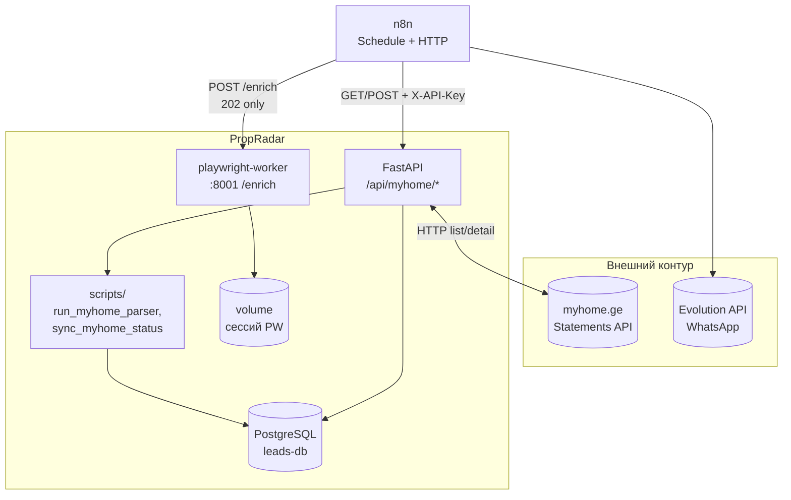

# Ingress и контуры PropRadar

Канон интеграций и границ системы в связке с `docs/AI_GOVERNANCE.md`. Документ описывает, как внешний контур (myhome.ge, n8n, Evolution/WhatsApp) стыкуется с **PropRadar API** и **leads-db**, без дублирования полного governance-текста.

---

## Четыре домена системы

Дословно из канона (`docs/AI_GOVERNANCE.md`, раздел «Четыре домена системы»):

```
[1] ПАРСИНГ          — сбор объявлений с платформ, дедупликация
[2] ФИЛЬТРАЦИЯ       — скоринг, отсев агентств, приоритизация лидов
[3] КОММУНИКАЦИЯ     — WhatsApp-бот, согласие, сбор данных от продавца
[4] МОНЕТИЗАЦИЯ      — передача агентствам, трекинг сделок, выплаты
```

**Связь с ingress:** поток myhome → API CLI/HTTP → БД относится к **[1] ПАРСИНГ** (и подготовке данных). Очередь «исчезнувших» и выдача в WhatsApp — **[2]** (сигналы к отсеву/приоритету) и **[3]** (канал связи). Передача лидов агентствам и учёт сделок — **[4]**; в текущей цепочке n8n + Evolution это преимущественно подготовительные и коммуникационные шаги до полной монетизации.

---

## Поток данных и управления (myhome.ge → API → n8n → БД → WhatsApp)

Интеграционный контур: **n8n** по расписанию вызывает **PropRadar HTTP API** (`/api/myhome/*`). Сам сервис API при `fetch-ids` и скриптах обращается к **внешнему HTTP API myhome** (`MYHOME_API_BASE_URL`, по канону — `api-statements.tnet.ge` с заголовком `X-Website-Key: myhome`). Запись и чтение бизнес-состояния — в **PostgreSQL leads-db**. Уведомления продавцу выполняются узлами n8n к **Evolution API** (WhatsApp), затем фиксация статуса снова через API в БД.



**Порядок по смыслу (типовой n8n workflow):** список ID → ingest в БД → **`POST http://playwright-worker:8001/enrich`** с телом **`{"adapter":"myhome","phase":"phone"}`** (ожидание только **HTTP 202**, без polling и без чтения тела как статуса выполнения) → discover «исчезнувших» → (опционально) цикл уведомлений в WhatsApp → `mark-rejected` в БД. У **`playwright-worker`** — отдельный том под файлы сессии браузера (см. `docker/app/docker-compose.yml`). Подробнее узлы — в `docs/n8n_myhome_workflow.md`.

**Фазы воркера (`POST /enrich`):** помимо **`phone`**, тот же контракт поддерживает **`phase`** **`detail`** (HTTP-детали в БД через myhome Statements API, как очередь в **`run_myhome_enricher`**) и **`pdf`** (Playwright **`page.pdf()`**). Рекомендуемый успех для HTTP-клиента n8n — по-прежнему только **202**; результат по лидам смотреть в БД / логах воркера. Типовой workflow описывает **`phone`** сразу после ingest; **`detail`** / **`pdf`** — отдельные узлы расписания или пакетный CLI **`scripts/run_myhome_enricher.py`** (см. `README.md`, `docs/playwright_worker.md`).

**Телефон (myhome, `phase=phone`):** в коде адаптера **`MyHomePhoneEnricher`** поле телефона обогащается через **Playwright** (открытие карточки, клик «показать номер», ответ **`phone/show`**; применяется **playwright-stealth**, см. код). Оркестрация n8n (вызов воркера на **HTTP 202**, без polling) не меняется.

---

## Схема n8n workflow (узлы и последовательность)

| № | Узел | Назначение |
|---|------|------------|
| 0 | **Schedule Trigger** | Периодический запуск (cron/интервал). |
| 1 | **HTTP Request** | `GET …/api/myhome/fetch-ids` — массив external ID. |
| 2a | **Set / Code** | Сборка тела `{"ids": [...]}` для ingest. |
| 2b | **HTTP Request** | `POST …/api/myhome/ingest`. |
| 2c | **HTTP Request** | `POST http://playwright-worker:8001/enrich`, тело JSON **`{"adapter":"myhome","phase":" … "}`**, где **`phase`** — **`phone`** (типово после ingest) или **`detail`** / **`pdf`** (опционально, отдельные узлы/расписание); успех узла для n8n — только **202**; **polling** не используется. |
| 3 | **HTTP Request** | `POST …/api/myhome/sync-status` — discover исчезнувших. |
| 4 | **Split In Batches / Loop** | Обход элементов `disappeared`. |
| 5 | **HTTP Request** | Отправка в WhatsApp через Evolution (контракт версии Evolution — локально). |
| 6 | (опц.) **IF / Set** | Учёт ошибок отправки. |
| 7 | **HTTP Request** | `POST …/api/myhome/mark-rejected` — обновление статуса в БД. |
| 8 | **Set / Slack / лог** | Итоги запуска. |

Инварианты и пример ответов — в `docs/n8n_myhome_workflow.md` (раздел «Обзор и диаграмма»).

---

## API-контракты (`/api/myhome`)

Общие правила: префикс **`/api/myhome`**, заголовок **`X-API-Key`** (политика по `APP_ENV` / `PROPRADAR_API_KEY` — см. `docs/API.md`). Ниже — сверка с `src/api/myhome.py` и `docs/API.md`.

### `GET /api/myhome/fetch-ids`

**Query-параметры**

| Параметр | По умолчанию | Описание |
|----------|----------------|----------|
| `limit` | `all` | `all` или целое число ≥ 1 — ограничение числа ID. |
| `max_pages` | `500` | Верхняя граница страниц обхода API (1–10000). |
| `city` | `tbilisi` | Фильтр города для списка Statements. |
| `category` | `apartment` | Категория объявлений. |
| `object_type` | `apartment` | Тип объекта. |
| `seller_type` | `private` | Тип продавца. |

**Ответ:** JSON-массив идентификаторов (`list` чисел/строк).

> **Примечание:** в `docs/API.md` перечислены не все query из кода; при расхождении приоритет — реализация в `src/api/myhome.py` и OpenAPI `/docs`.

### `POST /api/myhome/ingest`

**Тело (JSON):** `{"ids": ["123", "456", ...]}` — элементы `int` или `str` допустимы.

**Поведение:** пустой `ids` или только пустые строки после нормализации → **200**, `{"parsed":0,"new":0,"errors":[]}` без вызова CLI.

**Ответ (успех):** объект `dict` из stdout `run_myhome_parser.py` — как минимум поля `parsed`, `new`, `errors` (см. `docs/API.md`).

### `POST /api/myhome/sync-status`

**Query:** `max_pages` (по умолчанию `500`, 1–10000).

**Тело:** пустое не требуется; совместимо с `Content-Type: application/json` и `{}`.

**Ответ:** JSON-объект discover: как минимум `disappeared` (массив) и `counts` (объект); точная структура — вывод `sync_myhome_status.py discover --fetch-api` (пример полей в `docs/n8n_myhome_workflow.md`).

### `POST /api/myhome/mark-rejected`

**Тело (JSON):** `{"ids": ["1","2"], "reason": "disappeared_from_api"}` — `ids` непустой после нормализации; `reason` по умолчанию `disappeared_from_api`, строка 1–500 символов.

**Ответ:** JSON-объект из stdout CLI (ожидаемо поля вида `updated`, `reason` — см. `docs/API.md`).

**Коды ошибок (сводно):** 400 (некорректный ввод), 403 (ключ в production), 502 (CLI/JSON), 503 (скрипт не найден), 504 (таймаут CLI) — детализация в `docs/API.md`.

---

## БД: роли `leads` и `leads_client`

| Объект | Роль в архитектуре |
|--------|---------------------|
| **`leads`** | Основная доменная таблица ядра: источник истины по лидам, статусам, обогащённым полям и JSON statement. Запись при парсинге/обогащении/sync. |
| **`leads_client`** | Проекция для **клиентской выдачи** (дашборды, выборки для операторов): денормализованные поля, синхронизируются с `leads` триггером/функцией (см. миграции в репозитории). Не подменяет инварианты ядра. |

Согласно `docs/AI_GOVERNANCE.md`, единственный допустимый рабочий экземпляр БД для бизнес-состояния — **leads-db** (PostgreSQL); порт на хосте в docker-infra — **5433** → 5432 в контейнере.

---

## Deployment: Docker, сеть, порты, переменные окружения

### Режимы порта API (согласованное описание расхождений)

| Режим | Порт / доступ | Источник правды |
|--------|----------------|-----------------|
| Локальный `uvicorn` из корня репозитория | **`--port 9000`** в примерах запуска | `docs/API.md` |
| Сервис **`api`** в `docker/app/docker-compose.yml` | **`8000:8000`** (хост:контейнер), внутри контейнера uvicorn **`0.0.0.0:8000`** | Комментарий и `command` в compose |

**Вывод:** для n8n и клиентов базовый URL должен указывать на **фактический** порт окружения (9000 локально или 8000 при compose), плюс переменная **`PROPRADAR_API_URL`** в n8n.

### Сеть Docker

- Сеть **`propradar`** создаётся вручную (`docker network create propradar`); сервисы **`leads-db`** (`docker/infra/docker-compose.yml`) и **`api`** (`docker/app/docker-compose.yml`) подключаются к ней. Рекомендуемый запуск из корня репозитория: **`compose.yaml`** с профилями **`infra`** / **`app`** (см. `docs/DEPLOY_SERVER.md`); интерполяция `${VAR}` и корневой `.env` согласованы с **project directory** = корень репо.
- Из контейнера n8n в той же сети API может быть доступен как **`http://api:8000`** (или другой порт, если изменён mapping); с хоста — `http://localhost:8000` при опубликованном порте.

### Имена переменных окружения (без значений секретов)

| Переменная | Назначение |
|------------|------------|
| `DATABASE_URL` | Подключение к PostgreSQL leads-db (как у CLI). |
| `APP_ENV` | Режим для политики API-ключа (`development` / иначе). |
| `PROPRADAR_API_KEY` | Секрет для `X-API-Key` в production. |
| `PROPRADAR_REPO_ROOT` | Корень репозитория с `scripts/` (в Docker типично `/srv`). |
| `MYHOME_CLI_TIMEOUT_SECONDS` | Таймаут subprocess для CLI (дефолт в Settings). |
| `MYHOME_API_BASE_URL` | Базовый URL внешнего API myhome (см. Settings). |
| `PROPRADAR_API_URL` | В n8n: базовый URL PropRadar API. |

Дополнительно для compose БД: `POSTGRES_USER`, `POSTGRES_PASSWORD`, `POSTGRES_DB` (см. `docker/infra/docker-compose.yml`).

---

## Связанные документы (источники правды)

| Документ | Содержание |
|----------|------------|
| [`docs/AI_GOVERNANCE.md`](AI_GOVERNANCE.md) | Канон агентов, домены, инварианты, процесс изменений. |
| [`docs/PropRadar_STATUS.md`](PropRadar_STATUS.md) | Оперативный статус проекта. |
| [`docs/API.md`](API.md) | HTTP API, аутентификация, коды ошибок, примеры curl. |
| [`docs/n8n_myhome_workflow.md`](n8n_myhome_workflow.md) | Пошаговый n8n workflow, переменные, troubleshooting. |
| OpenAPI | `GET /docs`, `GET /openapi.json` на запущенном API. |

Канонические markdown-файлы в репозитории лежат в каталоге **`docs/`** (относительно корня git).

---

## Метаданные

| Поле | Значение |
|------|----------|
| Статус | Active |
| Версия канона | 1.0 (согласовано с `AI_GOVERNANCE` v1.0) |
