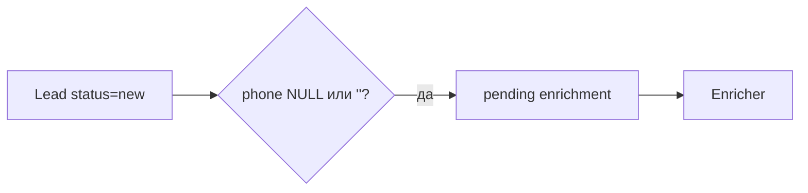
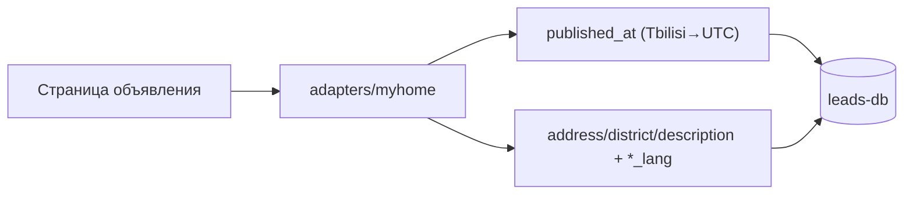

# PropRadar — статус проекта

Единственный источник оперативного статуса по `Docs/AI_GOVERNANCE.md` §8.

## 2026-05-05 — P1 hotfix: pending enrichment — учёт `phone=''`

- **Контекст:** emergency-path — enricher отдавал **`enriched=0`**, хотя в БД были лиды **new** без телефона.
- **Симптом:** очередь обогащения пустая при непустом наборе «новых» лидов.
- **Root cause:** отбор **pending enrichment** не учитывал **`phone`** как **пустую строку** (`''`), только **`NULL`**.
- **Фикс:** `list_pending_enrichment` для **new** выбирает **`phone IS NULL OR phone = ''`** (см. коммит **`8d347ce`**).
- **Scope:** код — коммит **`8d347ce`** (репозиторий/тесты); документация этой записи — **3** файла `.md`: **`docs/PropRadar_STATUS.md`**, **`CHANGELOG.md`**, **`README.md`**.
- **Проверка:** `@tester` — **PASS** (`pytest`, **`ruff`**); интеграция — **SKIP**; **`mypy`**: известный baseline в **`settings.py`** — **вне scope**.
- **Риски:** расширение выборки (лиды с намеренно пустым `phone` попадут в очередь чаще); семантика совпадает с «телефон ещё не получен».

## 2026-05-05 — P1 hotfix: `tzdata` для `ZoneInfo` на Windows (Asia/Tbilisi)

- **Контекст:** emergency-path — при локальном запуске на **Windows** падала работа с часовыми поясами для обогащения myhome (**Asia/Tbilisi → UTC**).
- **Симптом:** ошибка при создании **`ZoneInfo("Asia/Tbilisi")`** / связанная трассировка из цепочки **`published_at`** (нет данных зоны в окружении).
- **Root cause:** в сборках Python под Windows полная IANA-база для **`zoneinfo`** не гарантирована «из коробки»; для переносимости нужен пакет **`tzdata`** (PEP 615).
- **Реализация (минимальный scope):** только **`pyproject.toml`** — добавлена зависимость **`tzdata`** в `[project].dependencies`. Код и миграции не менялись.
- **Проверка:** `@tester` — **PASS**. Валидация сценария: **`ZoneInfo("Asia/Tbilisi")`** успешно; **`python scripts/run_myhome_enricher.py`** завершается без ошибки (при прочих выполненных условиях среды).
- **Документация:** этот файл, **`CHANGELOG.md`**, **`README.md`** (кратко про Windows).
- **Релиз вручную:** после `git pull` — переустановить зависимости окружения (`pip install -e .` / эквивалент), чтобы подтянулся **`tzdata`**.

## 2026-05-05 — myhome enricher: адаптеры, `*_lang`, `published_at` (Asia/Tbilisi → UTC), миграция 004

- **Контекст:** домен [1] ПАРСИНГ — уточнение обогащения myhome: вынесен адаптерный пакет, языковые метки текстовых полей, единые правила даты публикации с грузинской локалью, идемпотентные обновления в репозитории.
- **Реализация:** пакет `src/parsers/adapters/myhome/` (`enricher`, `extract`, `locale`, `published` и др.); фасад `src/parsers/myhome_enricher.py` сохранён для совместимости импортов. Миграция `migrations/004_add_text_lang_columns.sql`: колонки `address_lang`, `district_lang`, `description_lang` (VARCHAR(8)). Модель `Lead` и `PostgresLeadRepository`: поля `*_lang`, разбор `published_at` со страницы как локаль **Asia/Tbilisi** с сохранением в **UTC** (`parse_published_at_from_text`). Повторный прогон enricher не затирает уже заполненные значения теми же данными (идемпотентные апдейты на уровне репозитория).
- **Проверка:** `@tester` — PASS (по цепочке: Scanner PASS/SKIP, затем unit/регрессия согласно отчёту тестера). Ручной smoke: применить **004** к **leads-db**, сессия Playwright, `scripts/run_myhome_enricher.py`, сверка колонок `*_lang` и `published_at` (телефон и PII не логировать).
- **Документация:** `CHANGELOG.md`, `README.md`, этот файл.
- **Релиз вручную:** применить `migrations/004_add_text_lang_columns.sql` к **leads-db** после **003** (см. README, шаг локальной БД).

## 2026-05-04 — myhome.ge: обогащение лидов (Playwright, телефон, детали)

- **Контекст:** домен [1] ПАРСИНГ — после списка API нужны телефон (reCAPTCHA v3 + сессия) и поля со страницы объявления в **leads-db**.
- **Реализация:** `migrations/003_add_lead_details.sql`; расширение `Lead`, порта `LeadRepository` (`list_pending_enrichment`, `update_enriched_fields`) и `PostgresLeadRepository`; `src/parsers/exceptions.py` (`SessionExpiredError`), `src/parsers/myhome_enricher.py`; `scripts/myhome_login.py`, `scripts/run_myhome_enricher.py`; `Settings` (`MYHOME_EMAIL`, `MYHOME_PASSWORD`, `MYHOME_SESSION_PATH`, `MYHOME_ENRICH_LIMIT`); `.gitignore` для `scripts/myhome_session.json`; unit-тесты `tests/unit/test_myhome_enricher.py`. Без правок `src/parsers/base.py`, `src/parsers/myhome.py`, `docker/`, `.cursor/`, governance-файлов.
- **Проверка:** `@tester`: `ruff check src tests scripts`, `mypy src`, `pytest tests/unit/` — PASS. Ручной smoke: применить `003_*`, `myhome_login.py`, `run_myhome_enricher.py` при доступной БД и сети; `playwright install chromium` при необходимости.
- **Документация:** `README.md`, `CHANGELOG.md`, этот файл.
- **Релиз вручную:** миграция **003** на существующую **leads-db**; сохранение сессии; прогон enricher и сверка колонок в БД (телефон и детали не логировать).

## 2026-05-04 — Metabase: скрипт API для дашборда «PropRadar — Лиды»

- **Контекст:** автоматическая настройка дашборда через **Metabase HTTP API** без ручной расстановки шести карточек; идемпотентность при уже созданном дашборде.
- **Реализация:** **`scripts/setup_metabase_dashboard.py`** (сессия, поиск БД **`LEADS_DATABASE_NAME`** / «PropRadar Leads», **`POST /api/card`**, **`POST /api/dashboard`**, раскладка **`POST .../cards`**), **`pyproject.toml`** (**`ruff`** включает **`scripts/`**), корневой **`.env.example`** (закомментированные **`METABASE_*`**). **`docs/METABASE_SETUP.md`** — раздел про автоматизацию. Остальные запреты scope (без правок **`src/`**, **`migrations/`**, **`docker/infra`**) соблюдены.
- **Проверка:** Scanner PASS (подтверждено человеком). `@tester`: **`ruff check src tests scripts`**, **`mypy src`**, **`pytest -m "not integration"`** — OK; **`docker compose config`** (infra/tools/app) — OK. Smoke против живого Metabase — вручную (**`METABASE_*`**).
- **Документация:** **`docs/METABASE_SETUP.md`**, **`CHANGELOG.md`**, **`README.md`**, этот файл.
- **Релиз вручную:** один прогон скрипта после настройки админа и подключения БД в UI.

## 2026-05-04 — Metabase: дашборд и подключение leads-db

- **Контекст:** наблюдаемость/монетизация — дашборд для агентств и внутреннего мониторинга; Metabase в **`docker/tools`**, порт хоста **3031**, сеть **`propradar`**.
- **Реализация:** правки **`docker/tools/docker-compose.yml`** (Metabase: `JAVA_TIMEZONE`/`TZ`), **`docker/tools/.env.example`** (блок **`LEADS_DB_*`** для формы в UI), **`metabase/propradar_dashboard.json`** (6 карточек, SQL под PG15 и миграции `001`+`002`), **`docs/METABASE_SETUP.md`** (шаги, DNS, ручная сборка дашборда из JSON). **`docker/infra`**, **`src/`**, **`migrations/`**, **`docs/AI_GOVERNANCE.md`** не менялись.
- **Проверка:** Scanner PASS (подтверждено человеком). `@tester`: валидность JSON, `docker compose config` для **infra/tools/app** — OK; `ruff`/`mypy`/`pytest` ( регрессия кода) — OK. Ручной smoke: `up tools` и UI **http://localhost:3031** — по **`METABASE_SETUP.md`**.
- **Документация:** `docs/METABASE_SETUP.md`, `CHANGELOG.md`, этот файл.
- **Релиз вручную:** поднять infra + tools, подключить БД **leads** в Metabase, собрать дашборд по SQL из JSON.

## 2026-05-04 — Парсер myhome.ge (HTTP API, leads-db)

- **Контекст:** первый рабочий адаптер домена «Парсинг»; запуск по расписанию n8n, запись только новых объявлений в **leads-db** через **LeadRepository**; телефон/reCAPTCHA вне scope.
- **Реализация:** `src/parsers/myhome.py` (`MyHomeParser`), `PostgresLeadRepository` и `PostgresSessionFactory`, расширение `Lead` + `migrations/002_add_myhome_listing_fields.sql`, `scripts/run_myhome_parser.py` (JSON `parsed` / `new` / `errors`, коды выхода 0/1, `SELECT 1` до HTTP), `Settings.myhome_api_base_url`, unit-тесты парсера, интеграционный тест с маркером `@pytest.mark.integration`. Файлы в `docs/`, `docker/`, `.cursor/` и контракт `BaseParser` не менялись.
- **Проверка:** Scanner PASS (подтверждено человеком). `@tester`: `ruff check src tests`, `mypy src`, `pytest -m "not integration"` — PASS; интеграция к API при `MYHOME_INTEGRATION=1` — вручную/offline по умолчанию **SKIP**; `docker compose config` (infra/tools/app) — exit 0.
- **Документация:** `README.md` (миграции 002 и скрипт), `CHANGELOG.md`, этот файл.
- **Релиз вручную:** применить `002_*` к существующей БД; smoke `python scripts/run_myhome_parser.py` при доступном `DATABASE_URL` и сети.

## 2026-05-04 — Скелет приложения (src, Docker, миграции)

- **Контекст:** после Plan Check и реализации `@review` добавлен стартовый каркас репозитория без бизнес-логики парсеров; цель — подготовка к разработке парсера myhome.ge.
- **Реализация:** дерево `src/` (parsers `BaseParser`, domain `Lead`/`LeadStatus`/`Score`, repositories, services, FastAPI `/health`, `Settings`), `tests/`, `migrations/001_init_leads.sql`, `scripts/setup_venv.ps1`, `docker/{infra,tools,app}` с сетью `propradar`, порты хоста: leads-db **5433**, n8n **5678**, Metabase **3031**, Evolution **8080**, API **8000**; корневые `pyproject.toml`, `.env.example`, `.gitignore`, `.python-version`. Канон в `docs/` и `.cursor/` не менялись.
- **Проверка:** Scanner PASS (подтверждено человеком). `@tester`: `pytest tests/unit` (в т.ч. `test_api_health`), `ruff check src tests`, `mypy src`, `docker compose config` для трёх compose — успешно. Integration/E2E с поднятой БД и полным стеком в этой итерации не автоматизировались.
- **Документация:** `README.md`, `CHANGELOG.md` (в т.ч. строка про unit-тест `/health`), этот файл.
- **Релиз вручную:** при первом деплоне — создать сеть `docker network create propradar`, поднять `docker/infra`, применить SQL к `leads-db`, smoke `GET /health` на API.

## 2026-05-04 — Выравнивание `.cursor/` под PropRadar

- **Контекст:** после Plan Check выполнена реализация Fix Plan: агенты и skills в `.cursor/` синхронизированы с `Docs/AI_GOVERNANCE.md` v1.0; убрано наследие `dispatch-backend` / `DISPATCH_STATUS` / чужих продуктовых шаблонов.
- **Реализация:** обновлены `Rules-for-AI.mdc`, все `agents/*.mdc` по scope плана, skills (`dispatcher-chain-coordinator`, `documentor-doc-style`, `release-check`, `engineer-repairman-emergency-hotfix-report`, `architect-fix-plan-audit`).
- **Проверка:** grep по `.cursor/` — нет `dispatch-backend`, `DISPATCH_STATUS`, `usluga-market`, «Диспетчерская»; целевые пути доков — `Docs/…`. Сканер кода для чисто конфигурационного diff не требовался (docs-only / `.cursor`).
- **Документация:** этот файл; добавлен корневой `CHANGELOG.md` (первая запись).
- **Релиз вручную:** не применимо (нет деплоя кода).

## Бэклог

- Унифицировать в тексте `Docs/AI_GOVERNANCE.md` обозначение папки `docs/` vs фактическая `Docs/` на диске (отдельная задача вне последнего Fix Plan).

## Технический долг

- `Docs/INGRESS_ARCHITECTURE.md` — заготовка пустая; заполнить перед первым ingress-изменением в коде.

## ENV

_(раздел заполняется при появлении деплой-канона и секретов; не хранить значения в репозитории.)_
