# PropRadar — статус проекта

Единственный источник оперативного статуса по `Docs/AI_GOVERNANCE.md` §8.

## 2026-05-07 — Docker: корневой `compose.yaml`, профили, корневой `.env`

- **Контекст:** при merge compose из разных каталогов путались project directory и `DATABASE_URL`; нужен единый вход для деплоя (`git pull` + `docker compose up`).
- **Реализация:** в корне **`compose.yaml`** с `include` фрагментов и профилями **`infra`**, **`app`**, **`tools`**, **`proxy`**; во фрагментах сервисы помечены профилями; **`api`**: **`env_file: ../../.env`** (корень репозитория). Обновлены **`docs/DEPLOY_SERVER.md`**, **`README.md`**, **`Docs/INGRESS_ARCHITECTURE.md`**, **`CHANGELOG.md`**, **`docker/app/.env.example`**.
- **Проверка:** `docker compose --profile infra --profile app config` — OK (локально).
- **Дальнейший шаг по канону:** **`@process-guard` Diff Check** → при необходимости **`@release-check`**.

## 2026-05-07 — Evolution API: исправление `Database provider invalid` (DATABASE_* в compose)

- **Контекст:** контейнер **Evolution API** в **`docker/tools`** при старте сообщал **`Database provider invalid`** из‑за неполной или несогласованной конфигурации провайдера БД в окружении.
- **Реализация (код уже в репо):** в **`docker/tools/docker-compose.yml`** для сервиса **`evolution-api`** добавлены переменные **`DATABASE_*`** (PostgreSQL, учётные данные, имя БД, связка с **`leads-db`** в сети **`propradar`**); выровнены значения по умолчанию и fallback'и; в **`DATABASE_CONNECTION_URI`** пример указывает хост **`leads-db`**. В **`docker/tools/.env.example`** уточнены **`DATABASE_*`** и комментарии для переноса в локальный `.env`.
- **Проверка:** **Scanner** — **PASS**; **`@tester`** — **PASS** (сессия 2026-05-07).
- **Документация (запись @documentor):** этот файл, **`CHANGELOG.md`**.
- **Дальнейший шаг по канону:** **`@process-guard` Diff Check** → при PASS — **`@release-check`** / релиз по процессу.


| Показатель | Статус |
| ---------- | ------ |
| Scanner | ✅ PASS |
| QA (`@tester`) | 🧪 PASS |
| Документация | 📜 статус + changelog |
| Следующий гейт | 🛡️ `@process-guard` Diff Check |


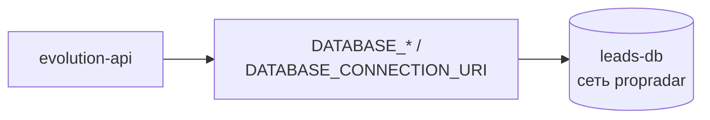


Прогресс задачи Evolution/DATABASE: `[▓▓▓▓▓▓▓▓▓░] 90%` (остаётся Diff Check и приёмка по процессу).

## 2026-05-07 — Reverse-proxy: TLS для n8n и Evolution (жёсткая граница портов)

- **Контекст:** вынести HTTPS-терминацию в `docker/reverse-proxy`, не публиковать прямые порты сервисов n8n/Evolution на хост, сделать монтирование сертификатов переносимым (не привязка к одному пути Let's Encrypt в конфиге nginx) и отловить «битые» PEM до старта nginx.
- **Реализация (код/compose в репо):** в `nginx/conf.d` пути TLS — фиксированные внутри контейнера `/etc/nginx/certs/{n8n,evolution}/…`; на хосте — четыре переменные **`N8N_TLS_FULLCHAIN`**, **`N8N_TLS_PRIVKEY`**, **`EVOLUTION_TLS_FULLCHAIN`**, **`EVOLUTION_TLS_PRIVKEY`** с дефолтами под текущие домены; bind-mount отдельных файлов вместо целых деревьев `live`/`archive`. Перед `nginx` команда compose **явно** вызывает `00-tls-preflight.sh` через **`sh`**; preflight проверяет **`-f`** (обычный файл, не каталог-заглушка) и **читаемость** **`-r`** для всех четырёх PEM. В `docker/tools` у **n8n** и **evolution-api** секция **`ports` отсутствует** — **5678** и **8080** остаются внутри сети **`propradar`**, снаружи — только **80/443** reverse-proxy (и явно открытые вами порты вроде Metabase **3031**).
- **Проверка:** **Scanner** — **PASS**; **`@tester`** — **PASS** (сессия 2026-05-07).
- **Документация (запись @documentor):** этот файл, `CHANGELOG.md`, уточнение матрицы портов в `docs/DEPLOY_SERVER.md`; детали TLS — `docker/reverse-proxy/README.md`.
- **Дальнейший шаг по канону:** **`@process-guard` Diff Check** → при PASS — `@release-check` / релиз по процессу.


| Показатель | Статус |
| ---------- | ------ |
| Scanner | ✅ PASS |
| QA (`@tester`) | 🧪 PASS |
| Документация | 📜 статус + changelog + runbook; README reverse-proxy — источник правды по TLS |
| Следующий гейт | 🛡️ `@process-guard` Diff Check |


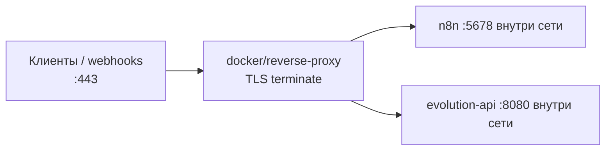


Прогресс контура reverse-proxy/TLS: `[▓▓▓▓▓▓▓▓▓░] 90%` (остаётся Diff Check и приёмка релиза по процессу).

## 2026-05-07 — Деплой: Hetzner/VPS, reverse-proxy, runbook, профили env

- **Контекст:** подготовка production-контура на выделенном сервере (в т.ч. Hetzner): единая точка входа через reverse-proxy, устойчивый порядок старта (`healthcheck` / `depends_on`), раздельные примеры переменных для локальной и серверной среды без секретов в репозитории.
- **Реализация (код/compose уже в репо):** runbook `docs/DEPLOY_SERVER.md`; слой `docker/reverse-proxy/**`; профили `**.env.example.local**` / `**.env.example.server**`; обновления healthchecks и `depends_on` в связанных compose; правки `README.md` и n8n-документации под серверный сценарий.
- **Проверка:** **Scanner** — **PASS** (подтверждение человека); `**@tester`** — **PASS**.
- **Документация (запись @documentor):** обновлены `CHANGELOG.md` и этот файл; пошаговый деплой и сетевой контур — `docs/DEPLOY_SERVER.md` (уже в репозитории), плюс обновления `README.md` и n8n runbook.


| Показатель        | Статус                                         |
| ----------------- | ---------------------------------------------- |
| Scanner           | ✅ PASS (со слов человека)                      |
| QA (`@tester`)    | 🧪 PASS                                         |
| Документация      | 📜 `docs/DEPLOY_SERVER.md`, README, n8n runbook |
| Прод-инфраструктура | reverse-proxy + профили env + порядок старта |


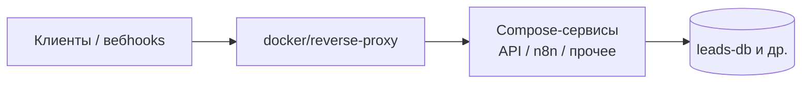


Прогресс подготовки деплоя (сервер/VPS): `[▓▓▓▓▓▓▓▓░░] 80%` (остались ручной smoke на сервере и финальный `@release-check` по процессу).

## 2026-05-07 — Docs: канон ingress (`INGRESS_ARCHITECTURE`)

- **Контекст:** пустой `**Docs/INGRESS_ARCHITECTURE.md`** не закрывал требование канонических документов из `Docs/AI_GOVERNANCE.md` (раздел «Назначение»); нужна единая картина контура myhome → API → n8n → БД → WhatsApp без правок кода.
- **Реализация:** создан полный текст `**Docs/INGRESS_ARCHITECTURE.md`** (домены, mermaid-поток, таблица узлов n8n, контракты API, `**leads**` vs `**leads_client**`, Docker/порты с явным разделением режимов **9000** vs **8000**, env-имена); синхронизированы `**CHANGELOG.md`** и этот файл.
- **Проверка:** docs-only; код и compose не менялись; контракты сверены с `src/api/myhome.py` и `docs/API.md`.


| Показатель               | Статус                                  |
| ------------------------ | --------------------------------------- |
| Объём                    | только `*.md`                           |
| Канон (ingress-документ) | `Docs/INGRESS_ARCHITECTURE.md` заполнен |


Прогресс документации ingress: `[▓▓▓▓▓▓▓▓▓▓] 100%` (черновик структуры закрыт).

## 2026-05-06 — P1: регрессия `since_days` в myhome `list_ids`

- **Контекст:** после изменений вокруг `fetch-ids` окно по датам (`since_days`) перестало корректно сужать выборку external ID в `list_ids`.
- **Реализация:** `src/parsers/adapters/myhome/list_ids.py` — восстановлено влияние `since_days` на отбор ID; `tests/unit/test_myhome_list_ids.py` — покрытие регрессии.
- **Проверка:** **Scanner** — **PASS**; `**@tester`** — **PASS**; целевые unit — **24 passed**; `**pytest tests`** — **51 passed**, **2 skipped**; `ruff` — OK.
- **Документация (та же цепочка):** обновлены `**CHANGELOG.md`**, этот файл.


| Показатель          | Статус                                   |
| ------------------- | ---------------------------------------- |
| Scanner             | ✅ PASS                                   |
| QA (`pytest tests`) | 🧪 51 passed, 2 skipped                  |
| Scope кода (фикс)   | `list_ids.py`, `test_myhome_list_ids.py` |


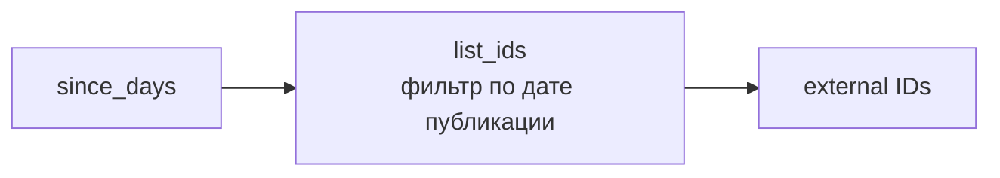


## 2026-05-06 — P0: myhome property filter key `real_estate_types`

- **Контекст:** аудит live API показал, что `object_types` не сужает выдачу по типу имущества, а `real_estate_types` влияет на набор ID.
- **Реализация:** в `src/parsers/adapters/myhome/list_ids.py` запрос к `/v1/statements/` приведён к `real_estate_types`; добавлена проверка консистентности `category` и `object_type`.
- **Проверка:** `pytest tests/unit/test_myhome_list_ids.py tests/unit/test_myhome_http_api.py` — PASS; `pytest tests` — PASS; `ruff` — OK.
- **Документация:** `CHANGELOG.md`, этот файл.


| Показатель | Статус                                                |
| ---------- | ----------------------------------------------------- |
| Scope      | `src/parsers/adapters/myhome/list_ids.py`, unit tests |
| Регрессии  | не выявлены                                           |


## 2026-05-06 — P1: `fetch-ids` без `since_days`, с `limit=all|N`

- **Контекст:** `since_days` в myhome list API не давал надёжной фильтрации; нужен режим «вся база» или «первые N ID».
- **Реализация:** `src/api/myhome.py` — удалён query `since_days`, добавлен `limit` (`all`/число); `src/parsers/adapters/myhome/list_ids.py` — убрана обработка окна дат, добавлен ранний stop по `limit`; обновлены unit-тесты и docs (`docs/API.md`, `docs/n8n_myhome_workflow.md`).
- **Проверка:** `pytest tests/unit/test_myhome_http_api.py tests/unit/test_myhome_list_ids.py` — **20 passed**; `pytest tests` — **47 passed**, **2 skipped**; `ruff` — OK.
- **Документация:** `CHANGELOG.md`, `docs/API.md`, `docs/n8n_myhome_workflow.md`, этот файл.


| Показатель | Статус                                                                     |
| ---------- | -------------------------------------------------------------------------- |
| Scope      | `src/api/myhome.py`, `src/parsers/adapters/myhome/list_ids.py`, tests/docs |
| Регрессии  | не выявлены                                                                |


## 2026-05-06 — P0 hotfix: `object_types` в myhome list query

- **Контекст:** фильтр типа имущества применял ключ `real_estate_types`, из-за чего API myhome мог игнорировать ограничение по объекту.
- **Реализация:** в `src/parsers/adapters/myhome/list_ids.py` заменён ключ на `object_types` в базовых params и в runtime-переопределении фильтра `category`.
- **Проверка:** `pytest tests/unit/test_myhome_list_ids.py tests/unit/test_myhome_http_api.py` — **19 passed**; `pytest tests` — **46 passed**, **2 skipped**; `ruff` — OK.
- **Документация:** `CHANGELOG.md`, этот файл.


| Показатель   | Статус                                    |
| ------------ | ----------------------------------------- |
| Hotfix scope | `src/parsers/adapters/myhome/list_ids.py` |
| Регресс API  | не ожидается                              |


## 2026-05-06 — P0: устойчивые импорты пакета `api` (`.myhome` / `.auth`)

- **Контекст:** риск `**ModuleNotFoundError`** / неоднозначности имени пакета `**api**` на `**sys.path**` при `**from api.myhome import router**`.
- **Реализация:** `**src/api/main.py`** — `**from .myhome import router**`; `**src/api/myhome.py**` — `**from .auth import ...**`. `**api/__init__.py**` без eager-import `**app**` (как после P1).
- **Проверка:** `**from api.main import app`** при `**PYTHONPATH=src**` — OK; `**pytest tests**` — **40 passed**, **2 skipped**.
- **Документация:** `**CHANGELOG.md`**, этот файл.


| Показатель   | Статус                                 |
| ------------ | -------------------------------------- |
| Hotfix scope | `src/api/main.py`, `src/api/myhome.py` |
| Регресс API  | не ожидается                           |


## 2026-05-06 — P1 hotfix: циклический импорт пакета `api` (uvicorn)

- **Контекст:** при `**uvicorn api.main:app`** с `**PYTHONPATH=src**` — `**ImportError**` из-за цикла: `**api/__init__.py**` тянул `**api.main**`, а `**api/main**` импортировал подмодуль через пакет `**api**`.
- **Реализация:** только `**src/api/__init__.py`** (убран eager-import `**app**`) и первичная правка `**src/api/main.py**`; затем **P0** — относительные импорты (см. секцию выше).
- **Проверка:** импорт `**from api.main import app`** — OK; **ruff** — OK.
- **Документация:** `**CHANGELOG.md`**, этот файл.


| Показатель   | Статус                                   |
| ------------ | ---------------------------------------- |
| Hotfix scope | `src/api/__init__.py`, `src/api/main.py` |
| Регресс API  | не ожидается                             |


## 2026-05-06 — FastAPI HTTP-обёртка myhome для n8n (Scanner PASS, цепочка до release-check)

- **Контекст:** n8n вызывает парсинг/синхронизацию через **HTTP** к PropRadar API вместо `Execute Command` на хосте.
- **Реализация:** `src/api/myhome.py` (`GET/POST /api/myhome/*`, subprocess к `**scripts/`** без их изменения); `src/api/auth.py` — `**X-API-Key**` / `**PROPRADAR_API_KEY**` (в production без ключа — **403**); `src/api/main.py` — подключение роутера; `src/config/settings.py` — `**PROPRADAR_REPO_ROOT`**, таймаут CLI; `**docker/app/docker-compose.yml**` — только сервис `**api**`: `**PYTHONPATH=/srv/src**`, volume `**../../:/srv:ro**`, `**depends_on: leads-db**` (совместный запуск с `**docker/infra**`); `**docs/API.md**`; обновлён `**docs/n8n_myhome_workflow.md**` под HTTP; `**tests/unit/test_myhome_http_api.py**`. Без правок `src/parsers/base.py`, governance, остального `**docker/**` вне `**docker/app/docker-compose.yml**`.
- **Проверка:** **Scanner** — **PASS** (подтверждение человека); `**pytest tests`** — **40 passed**, **2 skipped**; **ruff** на затронутых путях — OK.
- **Документация:** `**CHANGELOG.md`**, `**docs/API.md**`, `**docs/n8n_myhome_workflow.md**`, этот файл.
- **Условия перед деплоем:** задать `**PROPRADAR_API_KEY`** в production; поднять API командой merge compose (см. комментарий в compose); в n8n — `**PROPRADAR_API_URL**` и заголовок `**X-API-Key**`; smoke один прогон эндпоинтов вручную.


| Показатель          | Статус                     |
| ------------------- | -------------------------- |
| Scanner             | ✅ PASS                     |
| QA (`pytest`)       | 🧪 40 passed, 2 skipped    |
| Документация        | 📜 обновлена               |
| Готовность к деплою | ожидается `@release-check` |


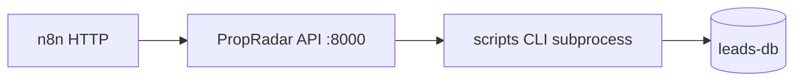


## 2026-05-06 — P1 hotfix: `setup_metabase_dashboard.py` создаёт все 10 карточек

- **Контекст:** скрипт подключал к дашборду только **6** карточек по фиксированным заголовкам; карточки sync (**8–10**) и **«Средняя цена (GEL)»** не создавались.
- **Реализация:** итерация по полному массиву `**cards`** из bundle, сортировка по `**position**`, логирование шага для каждой карточки, явная сетка `**_LAYOUT_BY_POSITION**` для позиций **1–10**. Файл: `**scripts/setup_metabase_dashboard.py`** только.
- **Проверка:** импорт модуля и assert: **10** карточек в bundle, ключи layout **1–10**; **ruff** — OK.
- **Документация:** `**CHANGELOG.md`**, этот файл.


| Показатель          | Статус                        |
| ------------------- | ----------------------------- |
| Hotfix scope        | `setup_metabase_dashboard.py` |
| Регресс bundle JSON | не менялся                    |


## 2026-05-06 — Myhome: n8n-синхронизация, `status_reason`, CLI (Scanner PASS, цепочка до release-check)

- **Контекст:** автоматизированное расписание парсинга myhome через n8n; сверка «исчезнувших» с API; фиксация причины в БД; WhatsApp из n8n (Evolution), не из Python.
- **Реализация:** миграция **010** (колонка `status_reason`); `scripts/fetch_myhome_ids.py`, `scripts/sync_myhome_status.py` (подкоманды `discover` / `mark-rejected`); флаг `--ingest-ids-json` в `scripts/run_myhome_parser.py`; модули `list_ids`, `ingest_detail`; расширение репозитория и домена `Lead`; `docs/n8n_myhome_workflow.md`; `README.md` — порядок миграций включает **010**. Без правок `src/parsers/base.py`, `docker/`, governance вне scope.
- **Проверка:** **Scanner** — **PASS** (подтверждение человека); `**pytest tests`** — **30 passed**, **2 skipped** (live myhome); ретесты после hotfix (**ingest** / `**sync_myhome_status`**) включены.
- **Документация:** `CHANGELOG.md`, `docs/n8n_myhome_workflow.md`, этот файл.
- **Условия перед деплоем:** применить `migrations/010_add_status_reason_to_leads.sql` на leads-db; настроить узлы n8n по `docs/n8n_myhome_workflow.md`; smoke WhatsApp вручную.


| Показатель          | Статус                                      |
| ------------------- | ------------------------------------------- |
| Scanner             | ✅ PASS                                      |
| QA (`pytest`)       | 🧪 30 passed, 2 skipped                     |
| Документация        | 📜 обновлена                                |
| Готовность к деплою | PASS WITH CONDITIONS (см. `@release-check`) |


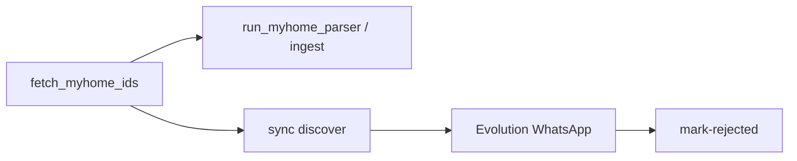


## 2026-05-06 — Финализация myhome/leads_client: КТ3 PASS, smoke подтверждён

- **Контекст:** после миграций **008/009** и серии P1 hotfix по Metabase карточке **7** зафиксирован итоговый рабочий контур клиентской выдачи.
- **Проверка:** контрольная точка **3** — **PASS**; smoke подтверждён человеком; в `leads_client` используются `city_name` и `owner_name`, карточка **«Последние лиды»** показывает клиентские поля.
- **Финальный вердикт:** `@release-check` — **PASS**.
- **Статус:** задача по финализации адаптера/проекции **закрыта**.
- **Документация:** `CHANGELOG.md`, `docs/METABASE_SETUP.md`, этот файл.


| Показатель     | Статус       |
| -------------- | ------------ |
| КТ3            | ✅ PASS       |
| Smoke (ручной) | ✅ PASS       |
| Release-check  | ✅ PASS       |
| Документация   | 📜 обновлена |


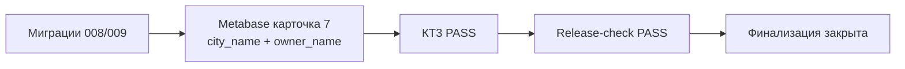


## 2026-05-06 — Проекция `leads_client`: `city_name` / `owner_name` из statement (миграция 009)

- **Контекст:** поля `**city_name`** и `**owner_name**` в клиентской проекции должны отражать данные из `**myhome_statement_json**`, без опоры на колонку `**leads.city_name**`.
- **Реализация:** `**migrations/009_add_city_name_to_leads_client.sql`** (после **008**) — `**ALTER TABLE ... ADD COLUMN IF NOT EXISTS`** для обоих полей, backfill через `**UPDATE ... FROM leads**` по `**(source, external_id)**`, `**CREATE OR REPLACE FUNCTION sync_leads_client_from_lead**` с заполнением и **ON CONFLICT** для `**city_name`** / `**owner_name**`. `**metabase/propradar_dashboard.json**`: обновлён `**schema_reference**` (28 столбцов, ссылка на **009**). `**README.md`**, `**CHANGELOG.md**` — порядок миграций и запись в журнале.
- **Проверка:** **Scanner** — **PASS**; `**@tester`** — **PASS**.


| Показатель     | Статус       |
| -------------- | ------------ |
| Scanner        | ✅ PASS       |
| QA (`@tester`) | 🧪 PASS      |
| Документация   | 📜 обновлена |


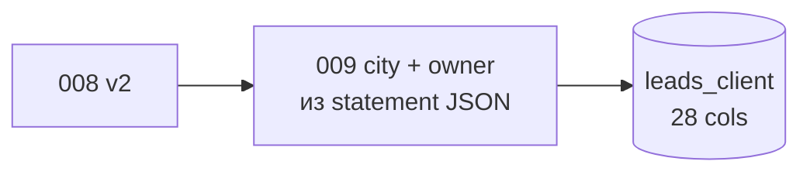


---

## 2026-05-06 — P1 hotfix Metabase: карточка 7 — `city_name` и `owner_name`

- **Контекст:** операторская таблица **«Последние лиды»** (`**position` 7** в `**metabase/propradar_dashboard.json`**) после контракта `**leads_client**` с **009** должна показывать **город** из `**city_name`**, а не `**urban_name**`; добавлен вывод `**owner_name**`.
- **Исправление:** обновлены `**description_ru`** и `**sql**` карточки **7** (подписи «Город» / «Имя владельца»).
- **Проверка:** `**@tester`** — **PASS**.
- **Документация:** `**CHANGELOG.md`**, `**docs/METABASE_SETUP.md**`, этот файл.


| Показатель     | Статус       |
| -------------- | ------------ |
| QA (`@tester`) | 🧪 PASS      |
| Документация   | 📜 обновлена |


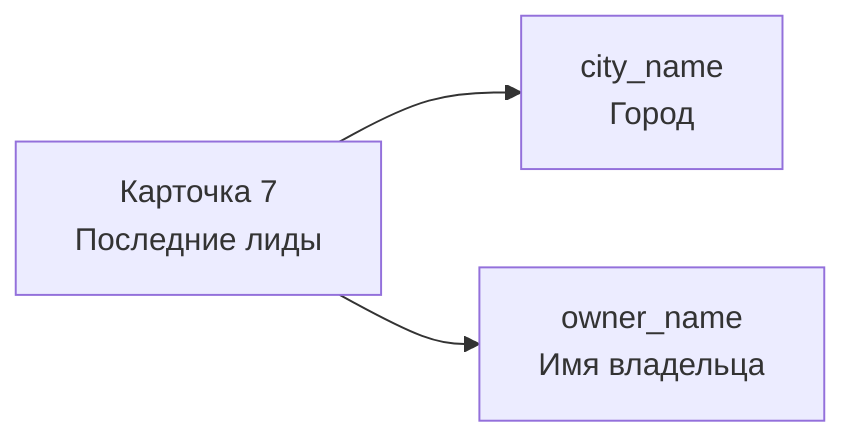


[▓▓▓▓▓▓▓▓▓▓] 100%

---

## 2026-05-06 — Проекция `leads_client` v2 (миграция 008)

- **Контекст:** после **007** зафиксирован контракт **UI/Metabase**: проекция **без** `**lead_id`** и без служебных UUID/языковых меток; **PK** по паре **(source, external_id)**; **26** клиентских столбцов (в т.ч. `**comment`** из `**leads.description`**, фрагмент **statement** в `**dynamic_title`** / `**urban_name`** / `**images**` и др.).
- **Реализация:** `**migrations/008_recreate_leads_client_v2.sql`** (строго после **007**) — пересоздание `**leads_client`**, триггера и функции синхронизации; `**metabase/propradar_dashboard.json`** — актуальный `**schema_reference**` на 008 и SQL под эту схему; в `**README.md**` порядок миграций: **008** после **007**.
- **Проверка:** **Scanner** — **PASS**; `**@tester`** — **PASS**.
- **Документация:** `**CHANGELOG.md`**, `**docs/METABASE_SETUP.md`**, `**README.md**`, этот файл.


| Показатель     | Статус       |
| -------------- | ------------ |
| Scanner        | ✅ PASS       |
| QA (`@tester`) | 🧪 PASS      |
| Документация   | 📜 обновлена |


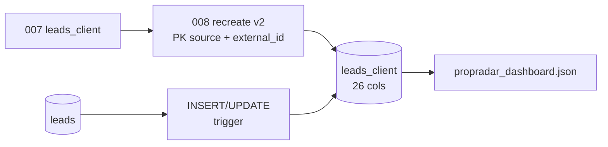


[▓▓▓▓▓▓▓▓▓▓] 100%

## 2026-05-05 — P1 hotfix Metabase: карточка 7 «Последние лиды» — только клиентские поля

- **Контекст:** в `**metabase/propradar_dashboard.json`** карточка с `**position` 7** (**«Последние лиды»**) должна показывать оператору только **клиентские** столбцы проекции `**leads_client`**, без `**lead_id`** и без служебных/технических колонок.
- **Исправление:** SQL карточки **7** переведён на набор полей для UI/агентств (без идентификаторов и тех. меток из ядра).
- **Проверка:** `**@tester`** — **PASS**.
- **Документация:** `**CHANGELOG.md`**, `**docs/METABASE_SETUP.md`**, этот файл.


| Показатель     | Статус       |
| -------------- | ------------ |
| QA (`@tester`) | 🧪 PASS      |
| Документация   | 📜 обновлена |


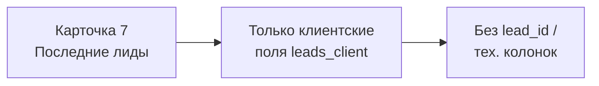


[▓▓▓▓▓▓▓▓▓▓] 100%

## 2026-05-05 — P1 hotfix Metabase: KeyError на `title_ru` карточки USD

- **Контекст:** при запуске `**scripts/setup_metabase_dashboard.py`** падение с **KeyError**: `**title_ru`** скалярной карточки **USD** в `**metabase/propradar_dashboard.json`** не совпадал с литералом в скрипте (сопоставление карточек по **точному** `**title_ru`**).
- **Исправление:** в bundle выровнен заголовок USD на `**Средняя цена объекта (USD)`**; карточки USD/GEL по-прежнему на `**leads_client`**.
- **Проверка:** `**@tester`** — **PASS**.
- **Документация:** `**CHANGELOG.md`**, `**Docs/METABASE_SETUP.md`**, этот файл.


| Показатель     | Статус       |
| -------------- | ------------ |
| QA (`@tester`) | 🧪 PASS      |
| Документация   | 📜 обновлена |


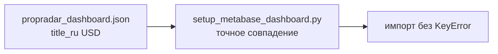


[▓▓▓▓▓▓▓▓▓▓] 100%

## 2026-05-05 — Metabase: дашборд на `leads_client` (bundle JSON)

- **Контекст:** после миграции **007** клиентская проекция `**leads_client`** — основной источник для карточек в `**metabase/propradar_dashboard.json`**.
- **Сделано:** все SQL в bundle переведены на `**leads_client`**; карточки «Средняя цена (USD)» и «Средняя цена (GEL)» (ROUND AVG `**price_usd`** / `**price_gel**`); таблица **«Последние лиды»** (LIMIT 20; первоначально в том же релизе включала и `**lead_id`**); в JSON добавлены `**schema_reference`** (ссылка на 007 и ключевые столбцы) и `**operator_instructions_ru**` для высоты карточки/прокрутки таблицы в UI Metabase. **Уточнение (P1 hotfix, карточка `position` 7):** вывод только клиентских полей — без `**lead_id`** и без служебных колонок (см. раздел выше и актуальный `**sql`** в bundle).
- **Проверка:** **Scanner** — **PASS**; `**@tester`** — **PASS**.
- **Документация:** `CHANGELOG.md`, `docs/METABASE_SETUP.md`, при необходимости `README.md`, этот файл.


| Показатель     | Статус       |
| -------------- | ------------ |
| Scanner        | ✅ PASS       |
| QA (`@tester`) | 🧪 PASS      |
| Документация   | 📜 обновлена |


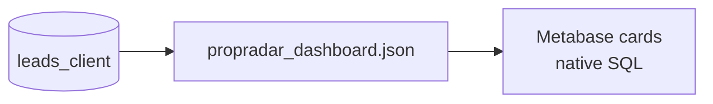


[▓▓▓▓▓▓▓▓▓▓] 100%

## 2026-05-05 — Закрытие задачи `leads_client`: Smoke PASS, КТ3 PASS

- **Контекст:** финальная проверка после миграции **007** и синхронизации проекции через trigger.
- **Проверка:** контрольная точка **3** — **PASS**; Smoke подтверждён человеком; таблица `**leads_client`** создана и синхронизируется с `**leads`**.
- **Результат:** клиентская структура (24 поля по бизнес-контракту) готова к финальному деплою.
- **Статус:** задача **закрыта**.
- **Документация:** `CHANGELOG.md`, этот файл.


| Показатель        | Статус       |
| ----------------- | ------------ |
| КТ3               | ✅ PASS       |
| Smoke (ручной)    | ✅ PASS       |
| leads_client sync | ✅ OK         |
| Документация      | 📜 обновлена |


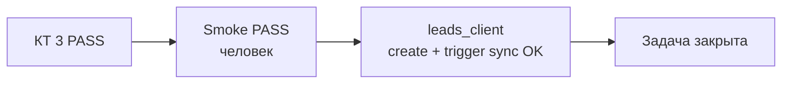


## 2026-05-05 — Проекция `leads_client` (миграция 007)

- **Контекст:** клиентские выборки и отчёты (Metabase/UI) удобнее вести по денормализованной проекции `**leads`**, без дублирования логики в приложении.
- **Реализация:** `**migrations/007_create_leads_client_table.sql`** (после **006**) — таблица `**leads_client`** (PK `**lead_id`**, 1:1 с `**leads`**, UNIQUE `**(source, external_id)**`); поля ядра из `**leads**` + фрагмент из `**myhome_statement_json**` (`**district_name**`, `**dynamic_title**`, `**urban_name**`, `**images**` при JSON-массиве); триггер `**trg_leads_sync_client**` — `**AFTER INSERT OR UPDATE**` на `**leads**` → `**sync_leads_client_from_lead**`, ON CONFLICT DO UPDATE; индексы `**idx_leads_client_external_id**`, `**idx_leads_client_district_name`**; initial fill из `**leads`** до включения триггера.
- **Проверка:** **Scanner** — **PASS**; `**@tester`** — **PASS**.
- **Документация:** `CHANGELOG.md`, `README.md` (список миграций), этот файл.
- **Релиз вручную:** применить **007** к **leads-db** сразу после **006**.


| Показатель       | Статус              |
| ---------------- | ------------------- |
| Scanner          | ✅ PASS              |
| Unit / регрессия | 🧪 PASS (`@tester`) |
| Документация     | 📜 обновлена        |


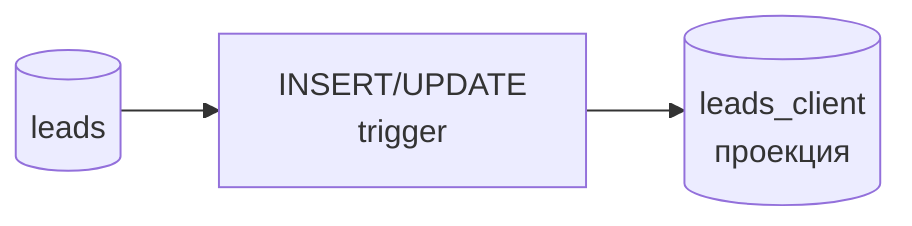


## 2026-05-05 — Закрытие задачи: Smoke PASS, контрольная точка 3

- **Контекст:** финальная проверка после цикла **006** / цены / очередь detail и backfill `**price_gel`**.
- **Проверка:** контрольная точка **3** — **PASS**; **Smoke** подтверждён человеком; для **20** лидов в выборке `**price_usd`** и `**price_gel`** заполнены корректно.
- **Финальный вердикт:** `@release-check` — **PASS**; деплой и smoke подтверждены человеком.
- **Статус:** задача **закрыта**.
- **Документация:** `CHANGELOG.md`, этот файл.


| Показатель             | Статус       |
| ---------------------- | ------------ |
| КТ3                    | ✅ PASS       |
| Smoke (ручной)         | ✅ PASS       |
| Выборка цен (20 лидов) | ✅ OK         |
| Документация           | 📜 обновлена |


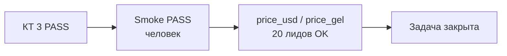


## 2026-05-05 — Backfill `price_gel` и очередь detail после миграции 006

- **Контекст:** после `**migrations/006_add_price_gel_rename_price_usd.sql`** в **leads-db** часть строк остаётся с `**price_gel = NULL`**; обогащение деталями должно снова подхватывать такие записи наряду с пустым адресом.
- **Сделано:** `**list_pending_detail_enrichment`** для `**source=myhome`**, `**status=new`**: `**address IS NULL OR price_gel IS NULL**`; скрипт `**scripts/backfill_price_gel.py**` — выборка только `**new**` с `**price_gel IS NULL**`, заполнение через тот же путь, что Statements API в enricher (`**--limit**`, 1–500).
- **Проверка:** **Scanner** — **PASS**; `**@tester`** — **PASS**.
- **Документация:** `CHANGELOG.md`, `README.md`, этот файл.
- **Релиз вручную:** после **006** при необходимости — `python scripts/backfill_price_gel.py` (доступны **DATABASE_URL** и API; PII не логировать).


| Показатель       | Статус              |
| ---------------- | ------------------- |
| Scanner          | ✅ PASS              |
| Unit / регрессия | 🧪 PASS (`@tester`) |
| Документация     | 📜 обновлена        |


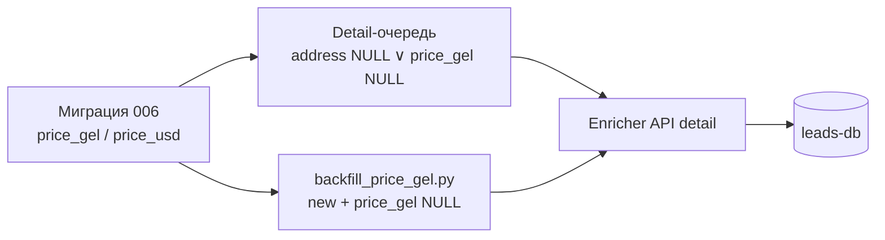


## 2026-05-05 — Ретро-фикс (закрытие замечаний Diff Check, P1 hotfix)

- **Контекст:** после **Diff Check** по горячему фиксу цен/описания оставались расхождения между артефактами репозитория и фактической схемой `**price_gel`** / `**price_usd`**.
- **Сделано:** в `**metabase/propradar_dashboard.json`** во всех SQL заменено `**price_total_usd`** → `**price_usd`**; в `**.gitignore**` добавлен игнор каталога `**data/myhome_pdf/**` (выгрузки PDF enricher не попадают в git); `**myhome_api_schema.csv**` выровнен под канон имён `**price_gel**` / `**price_usd**`.
- **Проверка:** `@tester` — **PASS** (подтверждено перед документированием); дальше — **@process-guard (Diff Check)** на полный diff.
- **Документация:** `CHANGELOG.md`, `docs/METABASE_SETUP.md`, при необходимости `README.md`, этот файл.


| Показатель   | Статус                      |
| ------------ | --------------------------- |
| Unit         | 🧪 PASS (по отчёту тестера) |
| Документация | 📜 обновлена                |


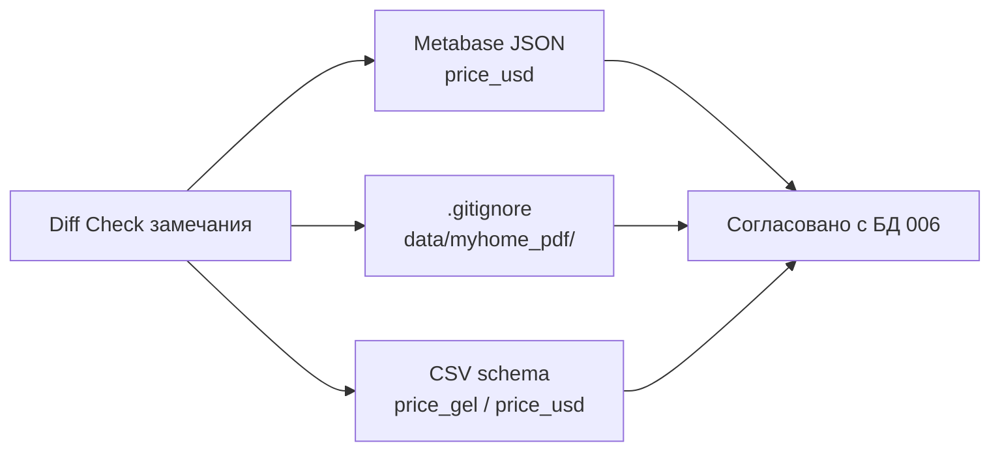


## 2026-05-05 — P1 hotfix: `description` без HTML, `price_gel` / `price_usd`, миграция 006

- **Контекст:** после API-first — в `**description`** попадали HTML-фрагменты (например `**<br />`**); цены нужно хранить явно в **двух валютах** с переименованием устаревшей колонки.
- **Симптомы:** «грязный» текст описания в БД; путаница в именовании `**price_total_usd`** при фактической семантике USD из API.
- **Реализация:** очистка HTML при маппинге `**description`** из ответа API; колонка `**price_gel`** (GEL из `**price.1`**), `**price_usd**` (USD из `**price.2**`, ранее `**price_total_usd**`); миграция `**migrations/006_add_price_gel_rename_price_usd.sql**` (после **005**).
- **Проверка:** `@tester` — **PASS** (unit); интеграция к live API — **SKIP** по умолчанию (`**MYHOME_INTEGRATION=1`** — вручную при необходимости).
- **Документация:** `CHANGELOG.md`, `README.md` (список миграций), `docs/METABASE_SETUP.md` (заметка про SQL), этот файл.
- **Риски:** сохранённые в Metabase и прочие SQL, где фигурирует `**price_total_usd`**, нужно перевести на `**price_usd`**; при отчётах по цене в лари добавить `**price_gel**`.
- **Релиз вручную:** применить **006** к **leads-db** сразу после **005**; при уже развёрнутом дашборде — проверить native-вопросы (см. Metabase-док).


| Показатель   | Статус                 |
| ------------ | ---------------------- |
| Unit         | ✅ PASS                 |
| Integration  | ⏭️ SKIP (по умолчанию) |
| Документация | 📜 обновлена           |


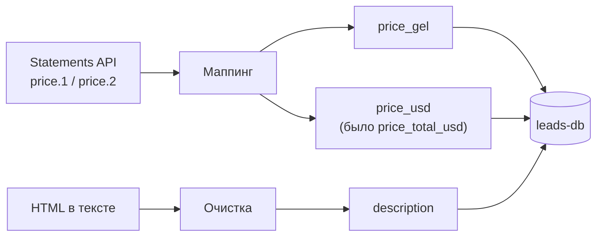


## 2026-05-05 — myhome.ge: API-first адаптер, очереди detail/phone/pdf, миграция 005

- **Контекст:** домен [1] ПАРСИНГ — список и карточка **myhome** через **api-statements.tnet.ge**; телефон и PDF остаются на Playwright.
- **Реализация:** `src/parsers/adapters/myhome/myhome_api_schema.csv` (SoT полей); `parser.py`, `schema.py`, `enricher.py` (GET `/v1/statements/{id}`), `phone.py`, `pdf.py`; фасады `src/parsers/myhome.py`, `src/parsers/myhome_enricher.py`; `migrations/005_myhome_api_first.sql`; разделение очередей в `LeadRepository`; настройки PDF в `Settings` / `.env.example`; `scripts/run_myhome_enricher.py` (три фазы). Без правок `src/parsers/base.py`, `docker/`, `.cursor/`, governance кроме этого файла.
- **Проверка:** `@tester` — **PASS** (`ruff`, `mypy src`, `pytest` unit); интеграция к live API — **SKIP** без `**MYHOME_INTEGRATION=1`**; при `**MYHOME_INTEGRATION=1`** — smoke list + detail (см. README).
- **Документация:** `README.md`, `CHANGELOG.md`, этот файл.
- **Риски:** доступность и контракт **Statements API**; для телефона нужны валидная Playwright-сессия и обход **reCAPTCHA**; PDF пишется на диск под `**MYHOME_PDF_OUTPUT_DIR`** — контроль места и прав; без миграции **005** возможны ошибки из‑за расхождения кода enricher и схемы **leads-db**.
- **Релиз вручную:** применить **005** к **leads-db** после **004**; smoke `python scripts/run_myhome_enricher.py` при доступной БД и сети (PII не логировать); при необходимости live-проверки — `MYHOME_INTEGRATION=1 pytest tests/integration/test_myhome_integration.py`.

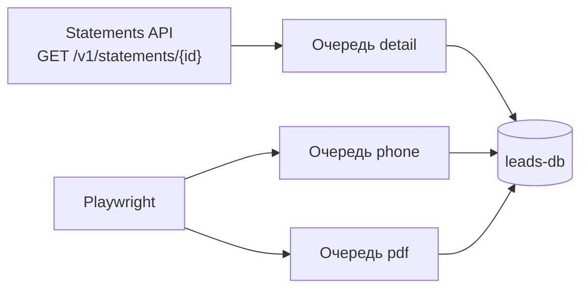


## 2026-05-05 — P1 hotfix: pending enrichment — учёт `phone=''`

- **Контекст:** emergency-path — enricher отдавал `**enriched=0`**, хотя в БД были лиды **new** без телефона.
- **Симптом:** очередь обогащения пустая при непустом наборе «новых» лидов.
- **Root cause:** отбор **pending enrichment** не учитывал `**phone`** как **пустую строку** (`''`), только `**NULL`**.
- **Фикс:** `list_pending_enrichment` для **new** выбирает `**phone IS NULL OR phone = ''`** (см. коммит `**8d347ce`**).
- **Scope:** код — коммит `**8d347ce`** (репозиторий/тесты); документация этой записи — **3** файла `.md`: `**docs/PropRadar_STATUS.md`**, `**CHANGELOG.md`**, `**README.md**`.
- **Проверка:** `@tester` — **PASS** (`pytest`, `**ruff`**); интеграция — SKIP; `**mypy`**: известный baseline в `**settings.py**` — **вне scope**.
- **Риски:** расширение выборки (лиды с намеренно пустым `phone` попадут в очередь чаще); семантика совпадает с «телефон ещё не получен».

```mermaid
flowchart LR
  N[Lead status=new] --> P{phone NULL или ''?}
  P -->|да| Q[pending enrichment]
  Q --> E[Enricher]
```


## 2026-05-05 — P1 hotfix: `tzdata` для `ZoneInfo` на Windows (Asia/Tbilisi)

- **Контекст:** emergency-path — при локальном запуске на **Windows** падала работа с часовыми поясами для обогащения myhome (**Asia/Tbilisi → UTC**).
- **Симптом:** ошибка при создании `**ZoneInfo("Asia/Tbilisi")`** / связанная трассировка из цепочки `**published_at`** (нет данных зоны в окружении).
- **Root cause:** в сборках Python под Windows полная IANA-база для `**zoneinfo`** не гарантирована «из коробки»; для переносимости нужен пакет `**tzdata`** (PEP 615).
- **Реализация (минимальный scope):** только `**pyproject.toml`** — добавлена зависимость `**tzdata`** в `[project].dependencies`. Код и миграции не менялись.
- **Проверка:** `@tester` — **PASS**. Валидация сценария: `**ZoneInfo("Asia/Tbilisi")`** успешно; `**python scripts/run_myhome_enricher.py`** завершается без ошибки (при прочих выполненных условиях среды).
- **Документация:** этот файл, `**CHANGELOG.md`**, `**README.md`** (кратко про Windows).
- **Релиз вручную:** после `git pull` — переустановить зависимости окружения (`pip install -e .` / эквивалент), чтобы подтянулся `**tzdata`**.

```mermaid
flowchart LR
  W[Windows Python] --> Z[zoneinfo.ZoneInfo]
  Z --> T["tzdata (IANA)"]
  T --> L["Asia/Tbilisi → UTC"]
```


## 2026-05-05 — myhome enricher: адаптеры, `*_lang`, `published_at` (Asia/Tbilisi → UTC), миграция 004

- **Контекст:** домен [1] ПАРСИНГ — уточнение обогащения myhome: вынесен адаптерный пакет, языковые метки текстовых полей, единые правила даты публикации с грузинской локалью, идемпотентные обновления в репозитории.
- **Реализация:** пакет `src/parsers/adapters/myhome/` (`enricher`, `extract`, `locale`, `published` и др.); фасад `src/parsers/myhome_enricher.py` сохранён для совместимости импортов. Миграция `migrations/004_add_text_lang_columns.sql`: колонки `address_lang`, `district_lang`, `description_lang` (VARCHAR(8)). Модель `Lead` и `PostgresLeadRepository`: поля `*_lang`, разбор `published_at` со страницы как локаль **Asia/Tbilisi** с сохранением в **UTC** (`parse_published_at_from_text`). Повторный прогон enricher не затирает уже заполненные значения теми же данными (идемпотентные апдейты на уровне репозитория).
- **Проверка:** `@tester` — PASS (по цепочке: Scanner PASS/SKIP, затем unit/регрессия согласно отчёту тестера). Ручной smoke: применить **004** к **leads-db**, сессия Playwright, `scripts/run_myhome_enricher.py`, сверка колонок `*_lang` и `published_at` (телефон и PII не логировать).
- **Документация:** `CHANGELOG.md`, `README.md`, этот файл.
- **Релиз вручную:** применить `migrations/004_add_text_lang_columns.sql` к **leads-db** после **003** (см. README, шаг локальной БД).

```mermaid
flowchart LR
  A[Страница объявления] --> B[adapters/myhome]
  B --> C["published_at (Tbilisi→UTC)"]
  B --> D["address/district/description + *_lang"]
  C --> E[(leads-db)]
  D --> E
```


## 2026-05-04 — myhome.ge: обогащение лидов (Playwright, телефон, детали)

- **Контекст:** домен [1] ПАРСИНГ — после списка API нужны телефон (reCAPTCHA v3 + сессия) и поля со страницы объявления в **leads-db**.
- **Реализация:** `migrations/003_add_lead_details.sql`; расширение `Lead`, порта `LeadRepository` (`list_pending_enrichment`, `update_enriched_fields`) и `PostgresLeadRepository`; `src/parsers/exceptions.py` (`SessionExpiredError`), `src/parsers/myhome_enricher.py`; `scripts/myhome_login.py`, `scripts/run_myhome_enricher.py`; `Settings` (`MYHOME_EMAIL`, `MYHOME_PASSWORD`, `MYHOME_SESSION_PATH`, `MYHOME_ENRICH_LIMIT`); `.gitignore` для `scripts/myhome_session.json`; unit-тесты `tests/unit/test_myhome_enricher.py`. Без правок `src/parsers/base.py`, `src/parsers/myhome.py`, `docker/`, `.cursor/`, governance-файлов.
- **Проверка:** `@tester`: `ruff check src tests scripts`, `mypy src`, `pytest tests/unit/` — PASS. Ручной smoke: применить `003_*`, `myhome_login.py`, `run_myhome_enricher.py` при доступной БД и сети; `playwright install chromium` при необходимости.
- **Документация:** `README.md`, `CHANGELOG.md`, этот файл.
- **Релиз вручную:** миграция **003** на существующую **leads-db**; сохранение сессии; прогон enricher и сверка колонок в БД (телефон и детали не логировать).

## 2026-05-04 — Metabase: скрипт API для дашборда «PropRadar — Лиды»

- **Контекст:** автоматическая настройка дашборда через **Metabase HTTP API** без ручной расстановки шести карточек; идемпотентность при уже созданном дашборде.
- **Реализация:** `**scripts/setup_metabase_dashboard.py`** (сессия, поиск БД `**LEADS_DATABASE_NAME`** / «PropRadar Leads», `**POST /api/card`**, `**POST /api/dashboard**`, раскладка `**POST .../cards**`), `**pyproject.toml**` (`**ruff**` включает `**scripts/**`), корневой `**.env.example**` (закомментированные `**METABASE_***`). `**docs/METABASE_SETUP.md**` — раздел про автоматизацию. Остальные запреты scope (без правок `**src/**`, `**migrations/**`, `**docker/infra**`) соблюдены.
- **Проверка:** Scanner PASS (подтверждено человеком). `@tester`: `**ruff check src tests scripts`**, `**mypy src`**, `**pytest -m "not integration"**` — OK; `**docker compose config**` (infra/tools/app) — OK. Smoke против живого Metabase — вручную (`**METABASE_***`).
- **Документация:** `**docs/METABASE_SETUP.md`**, `**CHANGELOG.md`**, `**README.md**`, этот файл.
- **Релиз вручную:** один прогон скрипта после настройки админа и подключения БД в UI.

## 2026-05-04 — Metabase: дашборд и подключение leads-db

- **Контекст:** наблюдаемость/монетизация — дашборд для агентств и внутреннего мониторинга; Metabase в `**docker/tools`**, порт хоста 3031, сеть `**propradar`**.
- **Реализация:** правки `**docker/tools/docker-compose.yml`** (Metabase: `JAVA_TIMEZONE`/`TZ`), `**docker/tools/.env.example`** (блок `**LEADS_DB_*`** для формы в UI), `**metabase/propradar_dashboard.json**` (6 карточек, SQL под PG15 и миграции `001`+`002`), `**docs/METABASE_SETUP.md**` (шаги, DNS, ручная сборка дашборда из JSON). `**docker/infra**`, `**src/**`, `**migrations/**`, `**docs/AI_GOVERNANCE.md**` не менялись.
- **Проверка:** Scanner PASS (подтверждено человеком). `@tester`: валидность JSON, `docker compose config` для **infra/tools/app** — OK; `ruff`/`mypy`/`pytest` ( регрессия кода) — OK. Ручной smoke: `up tools` и UI **[http://localhost:3031](http://localhost:3031)** — по `**METABASE_SETUP.md`**.
- **Документация:** `docs/METABASE_SETUP.md`, `CHANGELOG.md`, этот файл.
- **Релиз вручную:** поднять infra + tools, подключить БД **leads** в Metabase, собрать дашборд по SQL из JSON.

## 2026-05-04 — Парсер myhome.ge (HTTP API, leads-db)

- **Контекст:** первый рабочий адаптер домена «Парсинг»; запуск по расписанию n8n, запись только новых объявлений в **leads-db** через **LeadRepository**; телефон/reCAPTCHA вне scope.
- **Реализация:** `src/parsers/myhome.py` (`MyHomeParser`), `PostgresLeadRepository` и `PostgresSessionFactory`, расширение `Lead` + `migrations/002_add_myhome_listing_fields.sql`, `scripts/run_myhome_parser.py` (JSON `parsed` / `new` / `errors`, коды выхода 0/1, `SELECT 1` до HTTP), `Settings.myhome_api_base_url`, unit-тесты парсера, интеграционный тест с маркером `@pytest.mark.integration`. Файлы в `docs/`, `docker/`, `.cursor/` и контракт `BaseParser` не менялись.
- **Проверка:** Scanner PASS (подтверждено человеком). `@tester`: `ruff check src tests`, `mypy src`, `pytest -m "not integration"` — PASS; интеграция к API при `MYHOME_INTEGRATION=1` — вручную/offline по умолчанию **SKIP**; `docker compose config` (infra/tools/app) — exit 0.
- **Документация:** `README.md` (миграции 002 и скрипт), `CHANGELOG.md`, этот файл.
- **Релиз вручную:** применить `002_`* к существующей БД; smoke `python scripts/run_myhome_parser.py` при доступном `DATABASE_URL` и сети.

## 2026-05-04 — Скелет приложения (src, Docker, миграции)

- **Контекст:** после Plan Check и реализации `@review` добавлен стартовый каркас репозитория без бизнес-логики парсеров; цель — подготовка к разработке парсера myhome.ge.
- **Реализация:** дерево `src/` (parsers `BaseParser`, domain `Lead`/`LeadStatus`/`Score`, repositories, services, FastAPI `/health`, `Settings`), `tests/`, `migrations/001_init_leads.sql`, `scripts/setup_venv.ps1`, `docker/{infra,tools,app}` с сетью `propradar`, порты хоста: leads-db **5433**, n8n **5678**, Metabase **3031**, Evolution **8080**, API **8000**; корневые `pyproject.toml`, `.env.example`, `.gitignore`, `.python-version`. Канон в `docs/` и `.cursor/` не менялись.
- **Проверка:** Scanner PASS (подтверждено человеком). `@tester`: `pytest tests/unit` (в т.ч. `test_api_health`), `ruff check src tests`, `mypy src`, `docker compose config` для трёх compose — успешно. Integration/E2E с поднятой БД и полным стеком в этой итерации не автоматизировались.
- **Документация:** `README.md`, `CHANGELOG.md` (в т.ч. строка про unit-тест `/health`), этот файл.
- **Релиз вручную:** при первом деплоне — создать сеть `docker network create propradar`, поднять `docker/infra`, применить SQL к `leads-db`, smoke `GET /health` на API.

## 2026-05-04 — Выравнивание `.cursor/` под PropRadar

- **Контекст:** после Plan Check выполнена реализация Fix Plan: агенты и skills в `.cursor/` синхронизированы с `Docs/AI_GOVERNANCE.md` v1.0; убрано наследие `dispatch-backend` / `DISPATCH_STATUS` / чужих продуктовых шаблонов.
- **Реализация:** обновлены `Rules-for-AI.mdc`, все `agents/*.mdc` по scope плана, skills (`dispatcher-chain-coordinator`, `documentor-doc-style`, `release-check`, `engineer-repairman-emergency-hotfix-report`, `architect-fix-plan-audit`).
- **Проверка:** grep по `.cursor/` — нет `dispatch-backend`, `DISPATCH_STATUS`, `usluga-market`, «Диспетчерская»; целевые пути доков — `Docs/…`. Сканер кода для чисто конфигурационного diff не требовался (docs-only / `.cursor`).
- **Документация:** этот файл; добавлен корневой `CHANGELOG.md` (первая запись).
- **Релиз вручную:** не применимо (нет деплоя кода).

## Бэклог

- Унифицировать в тексте `Docs/AI_GOVERNANCE.md` обозначение папки `docs/` vs фактическая `Docs/` на диске (отдельная задача вне последнего Fix Plan).

## Технический долг

- *(актуально)* см. открытые P1/P2 в бэклоге и заметки в runbook `docs/DEPLOY_SERVER.md` после первого боевого прогона.

## ENV

*(раздел заполняется при появлении деплой-канона и секретов; не хранить значения в репозитории.)*