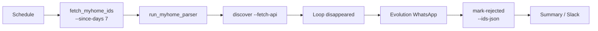

# n8n: расписание myhome.ge — fetch ID → ingest → discover → WhatsApp → mark-rejected

Оркестрация расписательного парсинга и синхронизации **myhome.ge** через n8n. Секреты Evolution API **не** попадают в Python: креды задаются в **Credentials** узлов n8n и/или в переменных окружения **инстанса n8n**.

## Оглавление

1. [Обзор и диаграмма](#обзор-и-диаграмма)
2. [Предварительные условия](#предварительные-условия)
3. [Переменные окружения](#переменные-окружения)
4. [Как создать workflow в n8n (общие шаги UI)](#как-создать-workflow-в-n8n-общие-шаги-ui)
5. [Узлы по шагам (со скриншотами)](#узлы-по-шагам-со-скриншотами)
6. [Обработка ошибок: retry и fallback](#обработка-ошибок-retry-и-fallback)
7. [Мониторинг executions и алерты](#мониторинг-executions-и-алерты)
8. [Примеры сообщений для разных локалей](#примеры-сообщений-для-разных-локалей)
9. [Troubleshooting](#troubleshooting)
10. [Экспорт workflow (опционально)](#экспорт-workflow-опционально)

---

## Обзор и диаграмма

**Шаги пайплайна**

| Шаг | Назначение | Команда / действие |
|-----|------------|-------------------|
| Триггер | Запуск по расписанию | Schedule Trigger (hourly / 6h / daily) |
| 1 | Список ID с API для «свежих» объявлений (окно) | `fetch_myhome_ids.py --since-days 7 --output json` |
| 2 | Ingest новых лидов | `run_myhome_parser.py` (опционально `--ingest-ids-json`) |
| 3 | Discover исчезнувшие (сверка БД ↔ полный список API) | `sync_myhome_status.py discover --fetch-api` |
| 4 | Контрольные сообщения в WhatsApp | HTTP Request → Evolution API, цикл по `disappeared` |
| 5 | Отметить отклонёнными в БД | `sync_myhome_status.py mark-rejected --ids-json … --reason disappeared_from_api` |
| 6 | Итоги и опционально Slack / файл | Set / Code + Slack или запись лога |

**Критический инвариант (не смешивать)**

- Вывод шага **1** с **`--since-days 7`** — это **узкое окно** для ограничения объёма **ingest**. Он **не** является полным снимком API.
- Шаг **3** с **`discover --fetch-api`** внутри скрипта загружает **полный** список ID с API (аналог **`fetch_myhome_ids.py --full`**). Поэтому **исчезнувшие** считаются корректно, даже если шаг 1 использует 7 дней.
- **Нельзя** подставлять в `discover` JSON только за 7 дней через `--api-ids-json` и ожидать корректной классификации «исчезнувших» для старых объявлений — получите ложные `disappeared`.



---

## Предварительные условия

- Репозиторий PropRadar на хосте, где n8n выполняет команды (`PROPRADAR_ROOT`), с установленными зависимостями Python и доступом к сети (myhome API).
- **`DATABASE_URL`** указывает на **leads-db** (PostgreSQL ядра); те же настройки, что и для локального запуска скриптов (см. `config.settings`).
- Применена миграция **`migrations/010_add_status_reason_to_leads.sql`**, если используется колонка `status_reason`.
- Evolution API доступен с хоста n8n (часто `http://localhost:8080` или имя сервиса в Docker-сети).

---

## Переменные окружения

Задайте на **уровне инстанса n8n** (или в `.env` docker-compose n8n). В узлах подставляйте через `$env.VAR` / выражения n8n.

| Имя | Назначение |
|-----|------------|
| `PROPRADAR_ROOT` | Абсолютный путь к корню репозитория PropRadar на машине, где выполняется Execute Command. |
| `PYTHON` | Опционально: путь к интерпретатору (`python3`, `python` или venv). Если не задан — используйте `python` в команде. |
| `PYTHONPATH` | Должно включать `src` при запуске скриптов: **`src`** относительно `PROPRADAR_ROOT` → на практике в команде: `PYTHONPATH=src` (Linux/macOS) или отдельный шаг `set PYTHONPATH=src` (Windows). |
| `DATABASE_URL` | Строка подключения к **leads-db**; читается скриптами через `Settings`. |
| `EVOLUTION_API_URL` | Базовый URL Evolution, например `http://localhost:8080`. В точном пути эндпоинта ориентируйтесь на вашу версию Evolution (см. [Evolution API](#узел-6-http-request--whatsapp-evolution)). |
| `EVOLUTION_API_AUTH` | Опционально: токен для заголовка (например Bearer) **или** имя credential-поля; предпочтительно хранить секрет в **n8n Credentials**, а не в plain env. |

**Замечание по Windows:** в одной строке `Execute Command` используйте `cd /d D:\PropRadar && set PYTHONPATH=src && python scripts\...` (или PowerShell-эквивалент), либо вынесите запуск в `.cmd` / `.ps1` в репозитории (вне scope этого гайда).

---

## Как создать workflow в n8n (общие шаги UI)

1. **Workflows → Add workflow** — задайте имя, например `PropRadar myhome sync`.
2. Добавьте первый узел **Schedule Trigger** (см. ниже).
3. Соединяйте узлы слева направо в порядке шагов; для ветвлений используйте **IF**, **Error Trigger** (отдельный workflow) или **Execute Workflow**.
4. **Settings → Credential** создайте учётку **Header Auth** или **HTTP Query Auth** под ваш Evolution (см. раздел Evolution).
5. В **Workflow Settings** включите при необходимости **Save successful executions** и **Save failed executions** для последующего аудита (см. [Мониторинг](#мониторинг-executions-и-алерты)).
6. **Save**, затем **Execute Workflow** для тестового прогона (лучше на копии с укороченным расписанием или Manual Trigger рядом с Schedule).

---

## Узлы по шагам (со скриншотами)

Создайте каталог под скриншоты (не коммитьте секреты на скринах):

- Рекомендуемый путь файлов: `docs/assets/n8n/nodes/`
- Имена ниже — договорённость; замените на свои при необходимости.

Для каждого узла: **Workflow Editor → добавить узел → тип**; после настройки сделайте скрин панели параметров и положите в указанный файл.

### Узел 0 — Schedule Trigger

- **Тип:** `Schedule Trigger`
- **Параметры расписания**

| Режим | Cron (UTC или TZ инстанса) | Пример интервала узла |
|-------|----------------------------|------------------------|
| Hourly | `0 * * * *` — каждый час в :00 | Каждые 60 минут |
| Каждые 6 ч | `0 */6 * * *` | Каждые 360 минут |
| Daily | `0 8 * * *` — 08:00 каждый день | Раз в 24 ч |

**Важно:** часовой пояс берётся из настроек n8n/сервера; зафиксируйте в runbook, в каком TZ работает инстанс.

- **Скриншот (вставьте):** `docs/assets/n8n/nodes/00-schedule-trigger.png`

---

### Узел 1 — Execute Command: Fetch API IDs (окно 7 дней)

- **Тип:** `Execute Command`
- **Команда (Linux/macOS, пример):**

```bash
cd "$PROPRADAR_ROOT" && PYTHONPATH=src "${PYTHON:-python}" scripts/fetch_myhome_ids.py --since-days 7 --output json
```

- **Выход:** stdout — JSON-массив строк ID, одна строка (массив).
- **Следующий узел:** **Code** (или **Function**) — распарсить stdout в массив для шага 2, например в n8n 2.x взять `items[0].json.stdout` и `JSON.parse`.

- **Скриншот:** `docs/assets/n8n/nodes/01-fetch-myhome-ids.png`

---

### Узел 2a — Code: подготовка `ingest-ids-json` (опционально)

- Если передаёте ID в парсер явно: сформируйте JSON-файл на диске **или** передайте через stdin в зависимости от возможностей хоста. Практичный путь: **Write Binary File** / второй **Execute Command** с heredoc не всегда удобен; проще **один** Execute Command, который пишет файл:

```bash
cd "$PROPRADAR_ROOT" && PYTHONPATH=src "${PYTHON:-python}" -c "
import json, pathlib, sys
path = pathlib.Path('/tmp/myhome_ingest_ids.json')
path.write_text(json.dumps(json.loads(sys.argv[1])), encoding='utf-8')
print(path)
" '{{ $json.idsJsonString }}'
```

Упростите под ваш канал данных: главное — файл с JSON-массивом для `--ingest-ids-json`.

- **Скриншот (если используете):** `docs/assets/n8n/nodes/02a-prepare-ingest-json.png`

---

### Узел 2b — Execute Command: Ingest новых лидов

**Вариант A — без входного списка (поведение по умолчанию CLI):**

```bash
cd "$PROPRADAR_ROOT" && PYTHONPATH=src "${PYTHON:-python}" scripts/run_myhome_parser.py
```

**Вариант B — ограничить конкретными ID из шага 1:**

```bash
cd "$PROPRADAR_ROOT" && PYTHONPATH=src "${PYTHON:-python}" scripts/run_myhome_parser.py --ingest-ids-json /tmp/myhome_ingest_ids.json
```

- **Логирование «сколько новых»:** скрипт печатает в stdout JSON одной строкой, например:
  `{"parsed": N, "new": K, "errors": [...]}`
  Добавьте узел **Code** после Execute Command и разберите `stdout` через `JSON.parse` — возьмите поле **`new`** как число новых лидов.
- **Retry:** см. раздел [Retry](#обработка-ошибок-retry-и-fallback).

- **Скриншот:** `docs/assets/n8n/nodes/02b-run-myhome-parser.png`

---

### Узел 3 — Execute Command: Discover исчезнувшие

```bash
cd "$PROPRADAR_ROOT" && PYTHONPATH=src "${PYTHON:-python}" scripts/sync_myhome_status.py discover --fetch-api
```

- **Вывод:** JSON вида:

```json
{
  "disappeared": [
    {
      "external_id": "...",
      "phone": "...",
      "address": "...",
      "owner_name": "...",
      "lead_id": "..."
    }
  ],
  "counts": {
    "api_ids": 0,
    "db_new_external_ids": 0,
    "disappeared": 0
  }
}
```

- **Следующий узел:** извлечь массив `disappeared` (Code node: один item на каждый элемент или передать массив в **Split Out**).

- **Скриншот:** `docs/assets/n8n/nodes/03-sync-discover.png`

---

### Узел 4 — Split In Batches / Loop: по одному элементу `disappeared`

- **Тип:** `Split In Batches` (или `Loop Over Items`, зависит от версии n8n)
- **Вход:** список объектов из `disappeared`.
- **Размер batch:** `1`, если для каждого отправляете отдельный HTTP запрос.

- **Скриншот:** `docs/assets/n8n/nodes/04-split-batches.png`

---

### Узел 5 — HTTP Request: WhatsApp через Evolution API

Эндпоинты Evolution зависят от версии и режима (**Baileys**, инстансы и т.д.). Шаблон из ТЗ: **`POST`** на базовый URL + путь отправки сообщения.

1. Задайте **Base URL** = `={{ $env.EVOLUTION_API_URL }}` или фиксируете `http://localhost:8080`.
2. **Path** уточните по вашему Swagger/докам Evolution (часто встречаются варианты с `/message/sendText/{instance}` или `/message/send/{instance}`).
3. **Authentication:** предпочтительно **Credential** типа **Header Auth**:
   - имя заголовка часто **`apikey`** для Evolution v2;
   - либо **Bearer** с токеном в **Generic Credential Type**.
4. **Body (JSON)** — пример структуры (поля замените на контракт **вашей** версии; не копируйте реальные ключи в репозиторий):

```json
{
  "number": "={{ $json.phone }}",
  "text": "={{ $json.message_text }}"
}
```

Текст `message_text` сформируйте в предыдущем узле **Set** / **Code** из шаблонов [локалей](#примеры-сообщений-для-разных-локалей).

5. **Settings узла:** включите **Continue On Fail** (или эквивалент), чтобы одна неудачная отправка не останавливала весь workflow.
6. **Параллельность:** при большом `disappeared` ограничьте параллельные HTTP (настройки batch / задержка), чтобы не упереться в rate limit WhatsApp/Evolution.

- **Скриншот:** `docs/assets/n8n/nodes/05-evolution-http.png`

---

### Узел 6 — Аккумуляция ошибок отправки (рекомендуется)

- После HTTP узла: **IF** «statusCode не 2xx» → **Set** / **Merge** в массив «ошибок» (или увеличивайте счётчик в **Static Data** через Code — осторожно с конкурентностью).
- Цель: на шаге итогов иметь **`send_errors_count`**.

- **Скриншот:** `docs/assets/n8n/nodes/06-wa-error-accumulator.png`

---

### Узел 7 — Execute Command: Mark rejected в БД

Фактический CLI **`mark-rejected`** принимает **только** список ID в файле:

```bash
sync_myhome_status.py mark-rejected --ids-json /path/to/ids.json --reason disappeared_from_api
```

Флага **`--fetch-api`** у подкоманды **`mark-rejected` нет** — полный список API уже использован на шаге **discover**.

**Политика ID для `--ids-json` (выберите одну и задокументируйте у себя):**

- **A (проще):** все `external_id` из `disappeared` — независимо от WhatsApp.
- **B (строже):** только те `external_id`, по которым HTTP отправка завершилась успехом (требует сбора списка в цикле).

Сформируйте файл JSON-массива строк:

```json
["12345", "67890"]
```

Затем:

```bash
cd "$PROPRADAR_ROOT" && PYTHONPATH=src "${PYTHON:-python}" scripts/sync_myhome_status.py mark-rejected --ids-json /tmp/myhome_mark_ids.json --reason disappeared_from_api
```

Ответ stdout: JSON с полем **`updated`** (число обновлённых строк).

- **Retry / Alert при БД:** см. ниже.

- **Скриншот:** `docs/assets/n8n/nodes/07-mark-rejected.png`

---

### Узел 8 — Итог: Set / Code + опционально Slack

- Соберите объект:
  - `run_at` (ISO время),
  - `ingest_new` (из шага 2),
  - `disappeared_count` (из `counts` или длина массива),
  - `mark_updated` (из шага 7),
  - `send_errors` (накопленные).
- **Slack:** узел **Slack** или **HTTP Request** к incoming webhook; **не** вшивайте webhook URL в репозиторий.
- **Файл:** узел **Write Binary File** / Execute Command `>> /var/log/propradar-n8n.log`.

- **Скриншот:** `docs/assets/n8n/nodes/08-summary.png`

---

## Обработка ошибок: retry и fallback

| Сбой | Политика | Настройка в n8n |
|------|----------|-----------------|
| myhome API / сетевые ошибки на шагах 1–3 | Повторить до **3** раз с **exponential backoff** | В узле **Execute Command** / **HTTP Request**: **Retry On Fail**, max tries = 3, подобрать `wait between tries` (например 5s, 30s, 120s) |
| WhatsApp (Evolution) недоступен или 4xx/5xx | **Не** валить workflow: **Continue On Fail**, лог + инкремент счётчика ошибок | Отдельная ветка после HTTP |
| БД недоступна на **mark-rejected** | **2** retry, затем **Alert** (Slack/email/второй workflow) | Retry On Fail = 2; затем **Error Workflow** или **IF** по коду выхода |
| Парсинг JSON из stdout | Try/catch в **Code**; при ошибке — уведомление и **стоп** ветки ingest | — |

**Fallback:** при исчерпании retry на критичных шагах (1–3) можно переходить к узлу **Slack Alert** с телом execution и ссылкой на **Executions** в n8n.

---

## Мониторинг executions и алерты

1. **История:** меню **Executions** — фильтр по workflow, статусу (`success` / `error`), времени.
2. **Лог каждого запуска:** фиксируйте в узле 8 минимум: дата/время, `new`, `disappeared`, `updated`, `send_errors`.
3. **Алерты по порогам (примеры):**
   - **`disappeared_count > N`** за сутки: агрегируйте через отдельную БД/таблицу или смотрите последние execution JSON; при превышении — Slack.
   - **`send_errors > M`:** сравнение в **IF** после цикла.
4. **Dead man’s switch (workflow не запустился):**
   - Заведите **второй** короткий workflow: Schedule (например раз в 12h) → **HTTP Request** к n8n API **Executions** (нужен API key n8n) или → проверка «последний успешный запуск основного workflow новее чем X часов».
   - При нарушении — отправка алерта.
   - Детали URL и прав зависят от версии n8n; зафиксируйте у себя ссылку на официальный **n8n API** для вашей установки.

---

## Примеры сообщений для разных локалей

Подстановки: `address`, `owner_name`, `external_id` (если адрес пуст).

**RU (базовый шаблон ТЗ)**

```text
Объявление {{address}} больше не найдено на myhome.ge. Если продано, подтвердите.
```

**RU (с обращением по имени, если есть)**

```text
Здравствуйте{{ owner_name ? ', ' + owner_name : '' }}. Объявление по адресу {{address}} больше не найдено на myhome.ge. Если сделка завершена, ответьте «продано».
```

**EN**

```text
Listing for {{address}} is no longer found on myhome.ge. If it was sold, please confirm.
```

**KA (ქართული)**

```text
განცხადება მისამართზე {{address}} აღარ ჩანსა myhome.ge-ზე. თუ გაყიდეთ, გთხოვთ დაადასტუროთ.
```

**Пустой адрес (любая локаль)**

```text
Объявление ID {{external_id}} больше не найдено на myhome.ge. Если продано, подтвердите.
```

---

## Troubleshooting

| Симптом | Возможная причина | Действие |
|--------|-------------------|----------|
| Огромный `disappeared` после смены логики | В `discover` передан урезанный `--api-ids-json` (например только 7 дней) | Использовать **`discover --fetch-api`**, не подмешивать вывод шага 1 как полный снимок API |
| `mark-rejected` падает с ошибкой файла | Неверный путь к `--ids-json` или невалидный JSON | Проверить содержимое `/tmp/...`, права на запись в CI хоста n8n |
| Evolution 401/403 | Неверный apikey / instance | Проверить Credentials; сравнить с рабочим запросом из Postman |
| Evolution 404 на `/message/send` | Другой путь в вашей версии | Открыть Swagger Evolution, обновить Path в HTTP узле |
| Пустой `disappeared`, но лиды есть | В БД нет `new` по `source=myhome` или все ID ещё в API | Проверить SQL; убедиться, что ingest отработал |
| Cron «сдвинут» на часы | TZ сервера ≠ ожидаемый | Уточнить TZ контейнера n8n; скорректировать cron |
| Дубли WhatsApp при повторном execution | Повторный прогон того же набора | Ввести операционный дедуп (учёт уже отправленных `external_id` в сторонней таблице или логе) — скрипты Python не меняются |

---

## Экспорт workflow (опционально)

Экспорт JSON из UI n8n можно сохранить, например, в `scripts/n8n_myhome_sync.json` — **перед коммитом** удалите секреты и обезличьте URL. Это не обязательный шаг для работы пайплайна.
