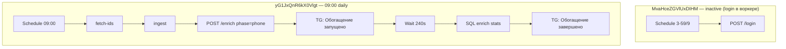
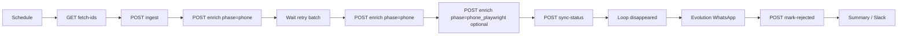

# n8n: расписание myhome.ge — fetch ID → ingest → discover → WhatsApp → mark-rejected

Оркестрация расписательного парсинга и синхронизации **myhome.ge** через n8n. **Рекомендуемый путь:** узлы **HTTP Request** к **PropRadar API** (см. `docs/API.md`, OpenAPI `/docs`). Ключ `**X-API-Key`** и URL API задаются в env/Credentials n8n. Секреты Evolution — отдельно в Credentials WhatsApp-узлов.

## Оглавление

1. [Обзор и диаграмма](#обзор-и-диаграмма)
2. [Предварительные условия](#предварительные-условия)
3. [Переменные окружения](#переменные-окружения)
4. [Как создать workflow в n8n (общие шаги UI)](#как-создать-workflow-в-n8n-общие-шаги-ui)
5. [Узлы по шагам (со скриншотами)](#узлы-по-шагам-со-скриншотами)
6. [Обработка ошибок: retry и fallback](#обработка-ошибок-retry-и-fallback)
7. [Мониторинг executions и алерты](#мониторинг-executions-и-алерты)
8. [Примеры сообщений для разных локалей](#примеры-сообщений-для-разных-локалей)
9. [Troubleshooting](#troubleshooting)
10. [Экспорт workflow (опционально)](#экспорт-workflow-опционально)
11. [Связка API, worker и CLI](#связка-api-playwright-worker-и-run_myhome_enricherpy)
12. [Два workflow: login cron и основной sync](#два-workflow-login-cron-и-основной-sync)

---

## Основной sync и login-if-needed в воркере

**Прод (n8n):** основной workflow шлёт только **`POST /enrich`** `phase=phone`. JWT при необходимости обновляет **playwright-worker** (login-if-needed в том же `_job_lock`, порог `MYHOME_SESSION_MIN_REMAINING_SECONDS`, default **40** с).

| Workflow | ID (n8n) | Расписание | Назначение |
| -------- | ---------- | ---------- | ---------- |
| **PropRadar — myhome v4** | `yG1JxQnR6kX0Vlgt` | cron **`0 9 * * *`** (09:00) + Manual | fetch → ingest → **`POST /enrich`** `phase=phone` → TG старт → **Wait 240 с** → SQL stats → TG итог |
| ~~PropRadar myhome session login~~ | `MvaHceZGVlUxDIHM` | ~~cron `3-59/9`~~ | **inactive** — login в воркере |

**Инвариант:** в основном workflow (`yG1JxQnR6kX0Vlgt`) узла **`POST /login` нет**. Отдельный cron-login **не используется**.



Старый workflow `isac0mztKLIIaYOP` — не использовать (неактивен).

---

## Обзор и диаграмма

**Шаги пайплайна**


| Шаг     | Назначение                       | Действие в n8n                                                             |
| ------- | -------------------------------- | -------------------------------------------------------------------------- |
| Триггер | Запуск по расписанию             | Schedule Trigger (hourly / 6h / daily)                                     |
| 1       | Список ID (full или batch)       | `GET` `**/api/myhome/fetch-ids?limit=all`** или `...&limit=100`            |
| 2       | Ingest по списку ID              | `POST` `**/api/myhome/ingest**` с телом `{"ids": [...]}`                   |
| 2c      | HTTP phone (primary)              | `POST` **`…/enrich`**, тело **`{"adapter":"myhome","phase":"phone"}`** — **2captcha** + **`phone/show`**. Успех n8n — только **HTTP 202** |
| 2d      | Добивка phone (retry)             | **Wait** 5–15 мин → снова **`phase":"phone"`** (лиды с **`phone_retries` 1–2**) |
| 2e      | (опц.) Playwright fallback        | **`phase":"phone_playwright"`** — только **после** батча/добивки **`phone`** (не параллельно); тот же **`claim_*`** в БД |
| —       | **`detail`** / **`pdf`**          | отдельные узлы или CLI; **polling** нет |
| 3       | Discover исчезнувшие             | `POST` `**/api/myhome/sync-status**` (внутри API — `discover --fetch-api`) |
| 4       | Контрольные сообщения в WhatsApp | HTTP Request → Evolution API, цикл по `disappeared`                        |
| 5       | Mark rejected в БД               | `POST` `**/api/myhome/mark-rejected**` с `ids` и `reason`                  |
| 6       | Итоги и опционально Slack / файл | Set / Code + Slack или запись лога                                         |


**Критический инвариант (не смешивать)**

- Вывод шага **1** с `limit=all` — полный снимок ID; с `limit=N` — первые N ID для батча/отладки.
- Шаг **3** с `**discover --fetch-api`** внутри скрипта загружает **полный** список ID с API (аналог `**fetch_myhome_ids.py --full`**). Поэтому **исчезнувшие** считаются корректно, даже если шаг 1 использует 7 дней.
- **Нельзя** подставлять в `discover` JSON только за 7 дней через `--api-ids-json` и ожидать корректной классификации «исчезнувших» для старых объявлений — получите ложные `disappeared`.




---

## Предварительные условия

- Запущен сервис **PropRadar API** (`uvicorn api.main:app` на хосте, порт **9000**, либо контейнер `api` в Docker на **8000**), с `**DATABASE_URL`**, доступом к myhome API и (в production) `**PROPRADAR_API_KEY**`. Из n8n в Docker к API: **`http://api:8000`** (та же сеть `propradar`, см. `docker/app/docker-compose.yml`). Если API запущен на хосте, а n8n в контейнере — **`http://host.docker.internal:9000`** (Windows / Docker Desktop) вместо `localhost`.
- Для шага обогащения через Playwright: в той же Docker-сети доступен **`playwright-worker`** на **`http://playwright-worker:8001`** (профили **`enricher`** / **`workers`** в `docker/app/docker-compose.yml`); на узле HTTP после ingest использовать **`POST /enrich`** и том сессий согласно compose (без секретов в репозитории).
- `**X-API-Key**` в каждом запросе к `/api/myhome/*`, если для окружения API требуется ключ (см. `docs/API.md`).
- Применена миграция `**migrations/010_add_status_reason_to_leads.sql**`, если используется колонка `status_reason`.
- Evolution API доступен с хоста n8n (часто `http://localhost:8080` или имя сервиса в Docker-сети).

---

## Переменные окружения (n8n)

Задайте на **уровне инстанса n8n** (или в Credentials). В узлах подставляйте через `$env.VAR` / выражения n8n.

Локально (API на хосте :9000, n8n на хосте), например:

```bash
PROPRADAR_API_URL=http://localhost:9000
```

Контейнер n8n + контейнер `api` в одной сети:

```bash
PROPRADAR_API_URL=http://api:8000
```

| Имя                  | Назначение                                                                                                   |
| -------------------- | ------------------------------------------------------------------------------------------------------------ |
| `PROPRADAR_API_URL`  | Базовый URL PropRadar API: **`http://localhost:9000`** (uvicorn на хосте), **`http://api:8000`** (оба в Docker), либо **`http://host.docker.internal:9000`** (n8n в Docker, API на хосте). |
| `PROPRADAR_API_KEY`  | Значение для заголовка `**X-API-Key`** (должно совпадать с `PROPRADAR_API_KEY` на стороне API в production). |
| `PLAYWRIGHT_WORKER_URL` | Опционально: базовый URL сервиса **`playwright-worker`** для узла **`POST /enrich`** (по умолчанию в Docker-сети **`http://playwright-worker:8001`**). |
| `EVOLUTION_API_URL`  | Базовый URL Evolution (см. узел **WhatsApp / Evolution** ниже).                                              |
| `EVOLUTION_API_AUTH` | Опционально: для Evolution; хранить в **Credentials**.                                                       |


**Альтернатива (legacy):** запуск CLI через **Execute Command** на хосте с клоном репозитория — не описывается здесь; при необходимости см. историю git до перехода на HTTP API.

---

## Связка API, playwright-worker и `run_myhome_enricher.py`

- **`DATABASE_URL`** настраивается для контейнеров **`api`** и **`playwright-worker`** (корневой `.env` на сервере), **не** через переменные n8n.
- **`MYHOME_SESSION_PATH`**, каталоги **`MYHOME_PDF_*`**, логин **`MYHOME_EMAIL`** / **`MYHOME_PASSWORD`** — на стороне воркера и/или хоста с CLI (см. `docs/playwright_worker.md`, `docs/DEPLOY_SERVER.md`).
- Один фоновой запуск воркера — **одна фаза**: тело **`{"adapter":"myhome","phase":"detail"|"phone"|"pdf"}`** (реализация **`src/worker/main.py`**). Типовой сценарий ниже вызывает **`phone`** после **`ingest`**; **`detail`** часто закрывается тем же батчем, что ingest/API, а **`pdf`** может вынесен на отдельный schedule или на пакетный CLI.
- Пакетный прогон **трёх фаз подряд** на хосте: **`python scripts/run_myhome_enricher.py`** — JSON в stdout с полями **`detail_enriched`**, **`detail_failed`**, **`detail_errors`**, **`phone_*`**, **`pdf_*`** (см. `README.md`).

---

## Как создать workflow в n8n (общие шаги UI)

1. **Workflows → Add workflow** — задайте имя, например `PropRadar myhome sync`.
2. Добавьте первый узел **Schedule Trigger** (см. ниже).
3. Соединяйте узлы слева направо в порядке шагов; для ветвлений используйте **IF**, **Error Trigger** (отдельный workflow) или **Execute Workflow**.
4. **Settings → Credential** создайте учётку **Header Auth** или **HTTP Query Auth** под ваш Evolution (см. раздел Evolution).
5. В **Workflow Settings** включите при необходимости **Save successful executions** и **Save failed executions** для последующего аудита (см. [Мониторинг](#мониторинг-executions-и-алерты)).
6. **Save**, затем **Execute Workflow** для тестового прогона (лучше на копии с укороченным расписанием или Manual Trigger рядом с Schedule).

---

## Узлы по шагам (со скриншотами)

Создайте каталог под скриншоты (не коммитьте секреты на скринах):

- Рекомендуемый путь файлов: `docs/assets/n8n/nodes/`
- Имена ниже — договорённость; замените на свои при необходимости.

Для каждого узла: **Workflow Editor → добавить узел → тип**; после настройки сделайте скрин панели параметров и положите в указанный файл.

### Узел 0 — Schedule Trigger

- **Тип:** `Schedule Trigger`
- **Параметры расписания**


| Режим      | Cron (UTC или TZ инстанса)      | Пример интервала узла |
| ---------- | ------------------------------- | --------------------- |
| Hourly     | `0 * * * *` — каждый час в :00  | Каждые 60 минут       |
| Каждые 6 ч | `0 */6 * * *`                   | Каждые 360 минут      |
| Daily      | `0 8 * * *` — 08:00 каждый день | Раз в 24 ч            |


**Важно:** часовой пояс берётся из настроек n8n/сервера; зафиксируйте в runbook, в каком TZ работает инстанс.

- **Скриншот (вставьте):** `docs/assets/n8n/nodes/00-schedule-trigger.png`

---

### Узел 1 — HTTP Request: Fetch IDs (full или batch)

- **Тип:** `HTTP Request`
- **Method:** `GET`
- **URL:** `={{ $env.PROPRADAR_API_URL }}/api/myhome/fetch-ids?limit=all`
  - Для батча: `...?limit=100`
  - Полный список без окна: `...?full=true` (см. OpenAPI `/docs`).
- **Authentication:** заголовок `**X-API-Key`**: `={{ $env.PROPRADAR_API_KEY }}` (или **Generic Header** в Credentials).
- **Ответ:** тело = JSON-массив ID (n8n обычно кладёт его в `json` item).
- **Следующий узел:** **Set** / **Code** — сформировать тело для шага 2: `{"ids": <массив из шага 1>}`.
- **Скриншот:** `docs/assets/n8n/nodes/01-fetch-myhome-ids.png`

---

### Узел 2a — Set / Code: тело `POST /api/myhome/ingest`

- Поле `**ids`**: массив из ответа узла 1 (например выражение вида `{{ $json }}`, если предыдущий узел вернул один item с массивом в корне — подстройте под фактическую структуру items в n8n).
- Пустой массив допустим: API вернёт `new: 0` без вызова CLI.
- **Скриншот (если используете):** `docs/assets/n8n/nodes/02a-prepare-ingest-json.png`

---

### Узел 2b — HTTP Request: Ingest

- **Тип:** `HTTP Request`
- **Method:** `POST`
- **URL:** `={{ $env.PROPRADAR_API_URL }}/api/myhome/ingest`
- **Headers:** `Content-Type: application/json`, `**X-API-Key`**
- **Body (JSON):** из узла 2a, например `{"ids": [ ... ]}`.
- **Ответ:** `{"parsed", "new", "errors"}` — поле `**new`** для итоговой статистики.
- **Примечание:** отдельного HTTP-эндпоинта для «полного» `run_myhome_parser` без списка ID нет; при необходимости расширяйте API отдельной задачей.
- **Скриншот:** `docs/assets/n8n/nodes/02b-run-myhome-parser.png`

---

### Узел 2c — HTTP Request: Playwright worker (`POST /enrich`)

Выполняется **после успешного** **`POST /api/myhome/ingest`** (узел 2b): постановка фоновой задачи обогащения в **`playwright-worker`**.

- **Тип:** `HTTP Request`
- **Method:** `POST`
- **URL:** базовый адрес из **`PLAYWRIGHT_WORKER_URL`** (без завершающего `/`) + **`/enrich`**, например выражение **`={{ $env.PLAYWRIGHT_WORKER_URL }}/enrich`**; если переменная не задана — укажите литерал **`http://playwright-worker:8001/enrich`** для контейнерного сценария в сети **`propradar`**.
- **Headers:** `Content-Type: application/json`
- **Body (JSON):** по умолчанию **`{"adapter":"myhome","phase":"phone"}`**. Допустимы **`"phase":"detail"`** и **`"phase":"pdf"`** — вынесите в **отдельные** HTTP-узлы (другой cron, другой порядок) при необходимости; контракт успеха для n8n тот же — **только 202**.
- **Ожидаемый успешный ответ:** код **202 Accepted**; тело ответа для принятия решений в workflow **не используется** (готовность по лидам — в БД / логах воркера).
- **Polling / повторный GET статуса:** не предусмотрены контрактом — узел завершается после получения **202**.
- **Ошибки:** коды вне **202** или сетевой сбой обрабатывайте политикой retry/error workflow n8n отдельно от ingest и discover.
- **Скриншот (опционально):** `docs/assets/n8n/nodes/02c-playwright-enrich.png`

---

### Узлы 2c-TG — Telegram + Wait + итоговая статистика (v4, `yG1JxQnR6kX0Vlgt`)

После **`POST /enrich`** `phase=phone` (узел «POST /enrich phone») workflow **не** опрашивает воркер — фиксированная пауза и сводка из БД.

| Узел | Тип | Назначение |
| ---- | --- | ---------- |
| **TG: Обогащение запущено** | Telegram | Уведомление о старте (HTTP **202** принят) |
| **Wait enrich 240s** | Wait | **240 с** (`timeInterval`); рассчитано на `ENRICH_LIMIT=50` и ~16 с/лид — **без polling** |
| **SQL enrich stats** | Postgres `executeQuery` | Агрегаты по `leads` где `source='myhome'`: `total`, `with_phone`, `failed` (`phone_retries >= 3`, без телефона), `pending` (без телефона, retries &lt; 3) |
| **TG: Обогащение завершено** | Telegram | Итог: получили телефон / не удалось / осталось / всего в базе (`{{ $json.* }}`) |

**SQL (как в workflow):**

```sql
SELECT
  COUNT(*)::bigint AS total,
  COUNT(*) FILTER (WHERE phone IS NOT NULL AND phone != '') AS with_phone,
  COUNT(*) FILTER (WHERE (phone IS NULL OR phone='') AND phone_retries >= 3) AS failed,
  COUNT(*) FILTER (WHERE (phone IS NULL OR phone='') AND phone_retries < 3) AS pending
FROM leads WHERE source='myhome'
```

**Инвариант:** не смешивать с отдельным cron-login (`MvaHceZGVlUxDIHM` — inactive). Workflow **`isac0mztKLIIaYOP`** не использовать.

---

### Узел 3 — HTTP Request: Discover (sync-status)

- **Тип:** `HTTP Request`
- **Method:** `POST`
- **URL:** `={{ $env.PROPRADAR_API_URL }}/api/myhome/sync-status` (опционально query `max_pages`).
- **Headers:** `**X-API-Key`**, `Content-Type: application/json` (тело можно пустым `{}`).
- **Ответ:** JSON вида:

```json
{
  "disappeared": [
    {
      "external_id": "...",
      "phone": "...",
      "address": "...",
      "owner_name": "...",
      "lead_id": "..."
    }
  ],
  "counts": {
    "api_ids": 0,
    "db_new_external_ids": 0,
    "disappeared": 0
  }
}
```

- **Следующий узел:** извлечь массив `disappeared` (Code / **Split Out**).
- **Скриншот:** `docs/assets/n8n/nodes/03-sync-discover.png`

---

### Узел 4 — Split In Batches / Loop: по одному элементу `disappeared`

- **Тип:** `Split In Batches` (или `Loop Over Items`, зависит от версии n8n)
- **Вход:** список объектов из `disappeared`.
- **Размер batch:** `1`, если для каждого отправляете отдельный HTTP запрос.
- **Скриншот:** `docs/assets/n8n/nodes/04-split-batches.png`

---

### Узел 5 — HTTP Request: WhatsApp через Evolution API

Эндпоинты Evolution зависят от версии и режима (**Baileys**, инстансы и т.д.). Шаблон из ТЗ: `**POST`** на базовый URL + путь отправки сообщения.

1. Задайте **Base URL** = `={{ $env.EVOLUTION_API_URL }}` или фиксируете `http://evolution-api:8080` внутри той же Docker-сети; за reverse-proxy (TLS) — `https://<ваш FQDN Evolution>`.
2. **Path** уточните по вашему Swagger/докам Evolution (часто встречаются варианты с `/message/sendText/{instance}` или `/message/send/{instance}`).
3. **Authentication:** предпочтительно **Credential** типа **Header Auth**:
  - имя заголовка часто `**apikey`** для Evolution v2;
  - либо **Bearer** с токеном в **Generic Credential Type**.
4. **Body (JSON)** — пример структуры (поля замените на контракт **вашей** версии; не копируйте реальные ключи в репозиторий):

```json
{
  "number": "={{ $json.phone }}",
  "text": "={{ $json.message_text }}"
}
```

Текст `message_text` сформируйте в предыдущем узле **Set** / **Code** из шаблонов [локалей](#примеры-сообщений-для-разных-локалей).

1. **Settings узла:** включите **Continue On Fail** (или эквивалент), чтобы одна неудачная отправка не останавливала весь workflow.
2. **Параллельность:** при большом `disappeared` ограничьте параллельные HTTP (настройки batch / задержка), чтобы не упереться в rate limit WhatsApp/Evolution.

- **Скриншот:** `docs/assets/n8n/nodes/05-evolution-http.png`

---

### Узел 6 — Аккумуляция ошибок отправки (рекомендуется)

- После HTTP узла: **IF** «statusCode не 2xx» → **Set** / **Merge** в массив «ошибок» (или увеличивайте счётчик в **Static Data** через Code — осторожно с конкурентностью).
- Цель: на шаге итогов иметь `**send_errors_count`**.
- **Скриншот:** `docs/assets/n8n/nodes/06-wa-error-accumulator.png`

---

### Узел 7 — HTTP Request: Mark rejected в БД

- **Тип:** `HTTP Request`
- **Method:** `POST`
- **URL:** `={{ $env.PROPRADAR_API_URL }}/api/myhome/mark-rejected`
- **Headers:** `**X-API-Key`**, `Content-Type: application/json`
- **Body (JSON):** `{"ids": ["..."], "reason": "disappeared_from_api"}` — список `**external_id`** (строки).

**Политика `ids` (как и для CLI):**

- **A (проще):** все `external_id` из `disappeared`.
- **B (строже):** только успешно уведомлённые в WhatsApp (собрать в цикле).
- **Ответ:** `{"updated": N, "reason": "..."}`.
- **Retry / Alert при БД:** см. [Retry](#обработка-ошибок-retry-и-fallback).
- **Скриншот:** `docs/assets/n8n/nodes/07-mark-rejected.png`

---

### Узел 8 — Итог: Set / Code + опционально Slack

- Соберите объект:
  - `run_at` (ISO время),
  - `ingest_new` (из шага 2),
  - `disappeared_count` (из `counts` или длина массива),
  - `mark_updated` (из шага 7),
  - `send_errors` (накопленные).
- **Slack:** узел **Slack** или **HTTP Request** к incoming webhook; **не** вшивайте webhook URL в репозиторий.
- **Файл:** узел **Write Binary File** / Execute Command `>> /var/log/propradar-n8n.log`.
- **Скриншот:** `docs/assets/n8n/nodes/08-summary.png`

---

## Обработка ошибок: retry и fallback


| Сбой                                        | Политика                                                                      | Настройка в n8n                                                                                          |
| ------------------------------------------- | ----------------------------------------------------------------------------- | -------------------------------------------------------------------------------------------------------- |
| PropRadar API / сеть на шагах 1–3           | Повторить до **3** раз с **exponential backoff**                              | В узле **HTTP Request**: **Retry On Fail**, max tries = 3, `wait between tries` (например 5s, 30s, 120s) |
| WhatsApp (Evolution) недоступен или 4xx/5xx | **Не** валить workflow: **Continue On Fail**, лог + инкремент счётчика ошибок | Отдельная ветка после HTTP                                                                               |
| БД недоступна на **mark-rejected**          | **2** retry, затем **Alert** (Slack/email/второй workflow)                    | Retry On Fail = 2; затем **Error Workflow** или **IF** по коду выхода                                    |
| 403 от PropRadar API                        | Неверный или отсутствующий `**X-API-Key`** при `APP_ENV` production           | Проверить `PROPRADAR_API_KEY` на API и в n8n; см. `docs/API.md`                                          |
| Невалидный JSON в ответе API                | Ошибка CLI внутри обёртки                                                     | Смотреть тело ответа **502** и логи контейнера `api`                                                     |


**Fallback:** при исчерпании retry на критичных шагах (1–3) можно переходить к узлу **Slack Alert** с телом execution и ссылкой на **Executions** в n8n.

---

## Мониторинг executions и алерты

1. **История:** меню **Executions** — фильтр по workflow, статусу (`success` / `error`), времени.
2. **Лог каждого запуска:** фиксируйте в узле 8 минимум: дата/время, `new`, `disappeared`, `updated`, `send_errors`.
3. **Алерты по порогам (примеры):**
  - `**disappeared_count > N`** за сутки: агрегируйте через отдельную БД/таблицу или смотрите последние execution JSON; при превышении — Slack.
  - `**send_errors > M`:** сравнение в **IF** после цикла.
4. **Dead man’s switch (workflow не запустился):**
  - Заведите **второй** короткий workflow: Schedule (например раз в 12h) → **HTTP Request** к n8n API **Executions** (нужен API key n8n) или → проверка «последний успешный запуск основного workflow новее чем X часов».
  - При нарушении — отправка алерта.
  - Детали URL и прав зависят от версии n8n; зафиксируйте у себя ссылку на официальный **n8n API** для вашей установки.

---

## Примеры сообщений для разных локалей

Подстановки: `address`, `owner_name`, `external_id` (если адрес пуст).

**RU (базовый шаблон ТЗ)**

```text
Объявление {{address}} больше не найдено на myhome.ge. Если продано, подтвердите.
```

**RU (с обращением по имени, если есть)**

```text
Здравствуйте{{ owner_name ? ', ' + owner_name : '' }}. Объявление по адресу {{address}} больше не найдено на myhome.ge. Если сделка завершена, ответьте «продано».
```

**EN**

```text
Listing for {{address}} is no longer found on myhome.ge. If it was sold, please confirm.
```

**KA (ქართული)**

```text
განცხადება მისამართზე {{address}} აღარ ჩანსა myhome.ge-ზე. თუ გაყიდეთ, გთხოვთ დაადასტუროთ.
```

**Пустой адрес (любая локаль)**

```text
Объявление ID {{external_id}} больше не найдено на myhome.ge. Если продано, подтвердите.
```

---

## Troubleshooting


| Симптом                                      | Возможная причина                                                        | Действие                                                                                                                  |
| -------------------------------------------- | ------------------------------------------------------------------------ | ------------------------------------------------------------------------------------------------------------------------- |
| Огромный `disappeared` после смены логики    | В `discover` передан урезанный `--api-ids-json` (например только 7 дней) | Использовать `**discover --fetch-api**`, не подмешивать вывод шага 1 как полный снимок API                                |
| `mark-rejected` через API возвращает 400/502 | Пустые `ids` или ошибка CLI                                              | Проверить тело запроса и логи `api`                                                                                       |
| Evolution 401/403                            | Неверный apikey / instance                                               | Проверить Credentials; сравнить с рабочим запросом из Postman                                                             |
| Evolution 404 на `/message/send`             | Другой путь в вашей версии                                               | Открыть Swagger Evolution, обновить Path в HTTP узле                                                                      |
| Пустой `disappeared`, но лиды есть           | В БД нет `new` по `source=myhome` или все ID ещё в API                   | Проверить SQL; убедиться, что ingest отработал                                                                            |
| Cron «сдвинут» на часы                       | TZ сервера ≠ ожидаемый                                                   | Уточнить TZ контейнера n8n; скорректировать cron                                                                          |
| Дубли WhatsApp при повторном execution       | Повторный прогон того же набора                                          | Ввести операционный дедуп (учёт уже отправленных `external_id` в сторонней таблице или логе) — скрипты Python не меняются |
| enrich **202**, телефон пустой; в логах `background job skipped` или `login_failed_exit_*` | Параллельные enrich/login или login не удался | Один enrich за раз; в логах — `myhome_login exit_code=0` и `enrich done` `phase=phone`; при `login_failed_exit_*` — проверить `MYHOME_EMAIL`/`MYHOME_PASSWORD` |


---

## Экспорт workflow (опционально)

Экспорт JSON из UI n8n можно сохранить, например, в `scripts/n8n_myhome_sync.json` — **перед коммитом** удалите секреты и обезличьте URL. Это не обязательный шаг для работы пайплайна.